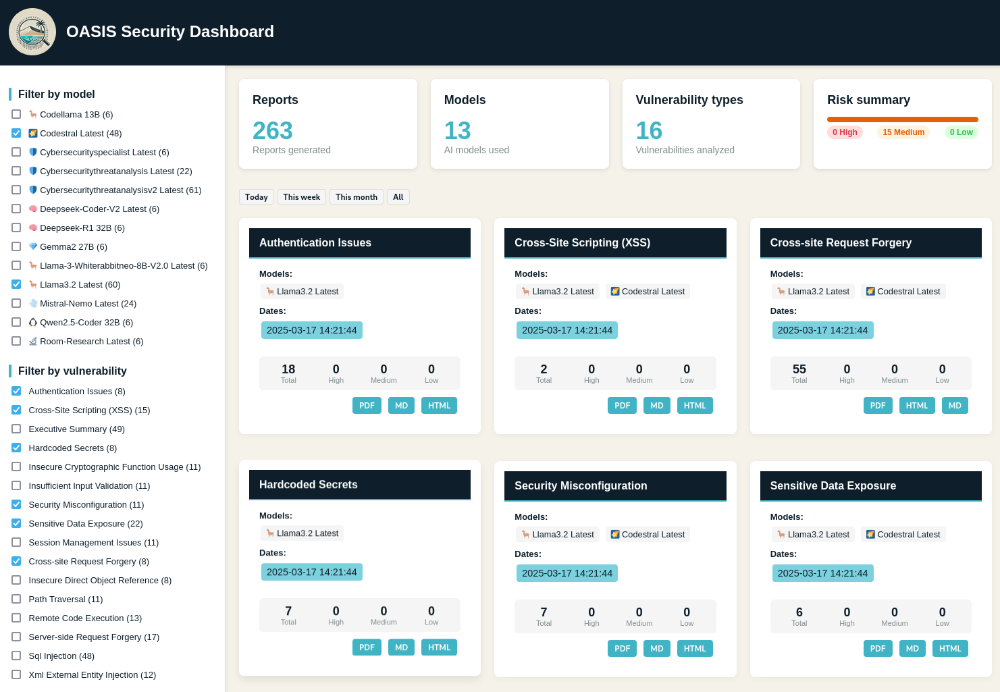

<p align="center">
  <a href="https://github.com/psyray/oasis/blob/main/LICENSE">
    
  </a>
  <a href="https://github.com/psyray/oasis/releases">
    
  </a>
  <a href="https://python.org">
    
  </a>
</p>

<div align="center">
  <a href="https://discord.gg/dW3sFwTtN3">
    
  </a>
</div>

<div align="center">
  <h1>OASIS</h1>
</div>
<p align="center">
  <small>🏝️ <strong>O</strong>llama <strong>A</strong>utomated <strong>S</strong>ecurity <strong>I</strong>ntelligence <strong>S</strong>canner</small>
</p>

<p align="center">
  
</p>

<p align="center">
  🛡️ An AI-powered security auditing tool that leverages Ollama models to detect and analyze potential security vulnerabilities in your code.
</p>

<p align="center">
  <em>Advanced code security analysis through the power of AI</em>
</p>

## 🌟 Features

- 🔍 **Multi-Model Analysis**: Leverage multiple Ollama models for comprehensive security scanning
- 🔄 **Two-Phase Scanning**: Use lightweight models for initial scanning and powerful models for deep analysis
- 🧠 **Adaptive Analysis**: Smart multi-level scanning that adjusts depth based on risk assessment
- 🔄 **Interactive Model Selection**: Guided selection of scan and analysis models with parameter-based filtering
- 💾 **Dual-Layer Caching**: Efficient caching for both embeddings and analysis results to dramatically speed up repeated scans
- 🔧 **Scan Result Caching**: Store and reuse vulnerability analysis results with model-specific caching
- 📊 **Rich Reporting**: Detailed reports in multiple formats (Markdown, PDF, HTML)
- 🔄 **Parallel Processing**: Optimized performance through parallel vulnerability analysis
- 📝 **Executive Summaries**: Clear overview of all detected vulnerabilities
- 🎯 **Customizable Scans**: Support for specific vulnerability types and file extensions
- 📈 **Distribution Analysis**: Advanced audit mode for embedding distribution analysis
- 🔄 **Content Chunking**: Intelligent content splitting for better analysis of large files
- 🤖 **Interactive Model Installation**: Guided installation for required Ollama models
- 🌐 **Web Interface**: Secure, password-protected web dashboard for exploring reports

## 🚀 Prerequisites

- Python 3.9+
- [Ollama](https://ollama.ai) installed and running
- pipx (for isolated installation)
  ```bash
  # On macOS
  brew install pipx
  pipx ensurepath

  # On Ubuntu/Debian
  python3 -m pip install --user pipx
  python3 -m pipx ensurepath

  # On Windows (with pip)
  pip install --user pipx
  python -m pipx ensurepath
  ```

## 📦 Installation

1. Clone the repository:
```bash
git clone https://github.com/psyray/oasis.git
cd oasis
```

2. Install with pipx:
```bash
# First time installation
pipx install --editable .
```

## 🔄 Update

If new releases are available, you can update the installation with:
```bash
pipx upgrade oasis
```
Between releases, you can update the installation with:
```bash
git pull origin master
```
note: because of the editable installation, you just need to pull the latest changes from the repository.

## 🗑️ Uninstallation
```bash
pipx uninstall oasis
```

## 🔧 Usage

Basic usage:
```bash
oasis --input-path [path_to_analyze]
```

### 🚀 Quick Test

To quickly test OASIS with sample files:
```bash
# Clone and install
git clone https://github.com/psyray/oasis.git
cd oasis
pipx install --editable .

# Run analysis on test files
oasis --input-path test_files/
```

This will analyze the provided test files and generate security reports in the parent directory of the folder to analyze, `security_reports`.

### 🔥 Advanced Usage Examples

Standard two-phase analysis with separate models:
```bash
# Use a lightweight model for initial scanning and a powerful model for deep analysis
oasis -i [path_to_analyze] -sm gemma3:4b -m gemma3:27b
```

Adaptive multi-level analysis:
```bash
# Use adaptive analysis mode with custom threshold
oasis -i [path_to_analyze] --adaptive -t 0.6 -m llama3
```

Targeted vulnerability scan with caching control:
```bash
# Analyze only for SQL Injection and XSS, clear cache, specify models
oasis -i [path_to_analyze] -v sqli,xss --clear-cache-scan -sm phi3:mini -m phi3
```

Full production scan:
```bash
# Comprehensive scan of a large codebase
oasis -i [path_to_analyze] -sm phi3:mini -m llama3,codellama -t 0.7 --vulns all
```

### 🎮 Command Line Arguments

#### Input/Output Options
- `--input` `-i`: Path to file, directory, or .txt file containing newline-separated paths to analyze
- `--output-format` `-of`: Output format [pdf, html, md] (default: all)
- `--extensions` `-x`: Custom file extensions to analyze (e.g., "py,js,java")

#### Analysis Configuration
- `--analyze-type` `-at`: Analyze type [standard, deep] (default: standard)
- `--embeddings-analyze-type` `-eat`: Analyze code by entire file or by individual functions [file, function] (default: file)
- `--adaptive` `-ad`: Use adaptive multi-level analysis that adjusts depth based on risk assessment
- `--threshold` `-t`: Similarity threshold (default: 0.5)
- `--vulns` `-v`: Vulnerability types to check (comma-separated or 'all')
- `--chunk-size` `-ch`: Maximum size of text chunks for embedding (default: auto-detected)

#### Model Selection
- `--models` `-m`: Comma-separated list of models to use for deep analysis
- `--scan-model` `-sm`: Model to use for quick scanning (default: same as main model)
- `--embed-model` `-em`: Model to use for embeddings (default: nomic-embed-text:latest)
- `--list-models` `-lm`: List available models and exit

#### Cache Management
- `--clear-cache-embeddings` `-cce`: Clear embeddings cache before starting
- `--clear-cache-scan` `-ccs`: Clear scan analysis cache for the current analysis type
- `--cache-days` `-cd`: Maximum age of cache in days (default: 7)

#### Web Interface
- `--web` `-w`: Serve reports via a web interface
- `--web-expose` `-we`: Web interface exposure (local: 127.0.0.1, all: 0.0.0.0) (default: local)
- `--web-password` `-wpw`: Web interface password (if not specified, a random password will be generated)
- `--web-port` `-wp`: Web interface port (default: 5000)

#### Logging and Debug
- `--debug` `-d`: Enable debug output
- `--silent` `-s`: Disable all output messages

#### Special Modes
- `--audit` `-a`: Run embedding distribution analysis
- `--ollama-url` `-ol`: Ollama URL (default: http://localhost:11434)
- `--version` `-V`: Show OASIS version and exit

### 💡 Getting the Most out of OASIS

For the best results with OASIS:

1. **Choose the right models**:
   - Use smaller models (4-7B parameters) for initial scanning
   - Use larger models (>20B parameters) for deep analysis
   - For code-specific vulnerabilities, prefer code-specific models like CodeLlama

2. **Optimize your workflow**:
   - For large codebases, start with a higher threshold (0.7-0.8) to focus on high-probability issues
   - Use the standard mode for faster scans, adaptive mode for more thorough analysis
   - Utilize caching effectively by only clearing when necessary

3. **Target your analysis**:
   - Specify relevant vulnerability types for your project
   - Filter by file extensions to focus on specific technologies
   - Use the audit mode to understand vulnerability distribution before full analysis

4. **Leverage the reports**:
   - View HTML reports for the best interactive experience
   - Use the web interface for team collaboration
   - Export PDF reports for documentation and sharing

### 🛡️ Supported Vulnerability Types

| Tag | Description |
|-----|-------------|
| `sqli` | SQL Injection |
| `xss` | Cross-Site Scripting |
| `input` | Insufficient Input Validation |
| `data` | Sensitive Data Exposure |
| `session` | Session Management Issues |
| `config` | Security Misconfiguration |
| `logging` | Sensitive Data Logging |
| `crypto` | Insecure Cryptographic Function Usage |
| `rce` | Remote Code Execution |
| `ssrf` | Server-Side Request Forgery |
| `xxe` | XML External Entity |
| `path` | Path Traversal |
| `idor` | Insecure Direct Object Reference |
| `auth` | Authentication Issues |
| `csrf` | Cross-Site Request Forgery |

## 📁 Output Structure

```
security_reports/
├── [model_name]/
│   ├── markdown/
│   │   ├── vulnerability_type.md
│   │   └── executive_summary.md
│   ├── pdf/
│   │   ├── vulnerability_type.pdf
│   │   └── executive_summary.pdf
│   └── html/
│       ├── vulnerability_type.html
│       └── executive_summary.html
```

## 💾 Cache Management

OASIS implements a sophisticated dual-layer caching system to optimize performance:

### Embedding Cache
- Stores vector embeddings of your codebase to avoid recomputing them for repeated analyses
- Default cache duration: 7 days
- Cache location: `.oasis_cache/[embedding_model_name]/`
- Use `--clear-cache-embeddings` (`-cce`) to force regeneration of embeddings

### Analysis Cache
- Stores the results of LLM-based vulnerability scanning for each model and analysis mode
- Separate caches for scan (lightweight) and deep analysis results
- Model-specific caching ensures results are tied to the specific model used
- Analysis type-aware (standard vs. adaptive)
- Use `--clear-cache-scan` (`-ccs`) to force fresh vulnerability scanning

This dual-layer approach dramatically improves performance:
- First-time analysis: Compute embeddings + full scanning
- Repeated analysis (same code): Reuse embeddings + scanning results
- After code changes: Update only changed file embeddings + scan only modified components

The cache system intelligently handles:
- Different model combinations (scan model + deep model)
- Different analysis types and modes
- Different vulnerability types
- Cache expiration based on configured days

For the best performance:
- Only clear the embedding cache when changing embedding models or after major code changes
- Clear the scan cache when upgrading to a newer/better model or after fixing vulnerabilities

## 📊 Audit Mode

OASIS offers a specialized Audit Mode that performs an embedding distribution analysis to help you understand your codebase's vulnerability profile before conducting a full scan.

```bash
# Run OASIS in audit mode
oasis --input-path [path_to_analyze] --audit
```

### What Audit Mode Does

- **Embedding Analysis**: Generates embeddings for your entire codebase and all vulnerability types
- **Similarity Distribution**: Calculates similarity scores between your code and various vulnerability patterns
- **Threshold Analysis**: Shows the distribution of similarity scores across different thresholds
- **Statistical Overview**: Provides mean, median, and max similarity scores for each vulnerability type
- **Top Matches**: Identifies the files or functions with the highest similarity to each vulnerability type

### Benefits of Audit Mode

- **Pre-Scan Intelligence**: Understand which vulnerability types are most likely to be present in your codebase
- **Threshold Optimization**: Determine the optimal similarity threshold for your specific project
- **Resource Planning**: Identify which vulnerabilities require deeper analysis with more powerful models
- **Faster Insights**: Get a quick overview without running a full security analysis
- **Targeted Scanning**: Use the results to focus your main analysis on the most relevant vulnerability types

### Example Workflow

1. **Initial Audit**: 
   ```bash
   oasis -i [path_to_analyze] --audit
   ```

2. **Targeted Analysis** based on audit results:
   ```bash
   oasis -i [path_to_analyze] -v sqli,xss,rce -t 0.65
   ```

The Audit Mode is especially valuable for large codebases where a full scan might be time-consuming, allowing you to make informed decisions about where to focus your security analysis efforts.

## 🌐 Web Interface

OASIS includes a web interface to view and explore security reports:



<br>

```bash
# Start the web interface with default settings (localhost:5000)
oasis --input-path [path_to_analyze] --web

# Start with custom port and expose to all network interfaces
oasis --input-path [path_to_analyze] --web --web-port 8080 --web-expose all

# Start with a specific password
oasis --input-path [path_to_analyze] --web --web-password mysecretpassword
```

### Security Features

- **Password Protection**: By default, a random password is generated and displayed in the console
- **Network Isolation**: By default, the server only listens on 127.0.0.1
- **Custom Port**: Configurable port to avoid conflicts with other services

When no password is specified, a secure random password will be generated and displayed in the console output. The web interface provides a dashboard to explore security reports, filter results, and view detailed vulnerability information.

## 📝 Changelog

See [CHANGELOG.md](CHANGELOG.md) for the latest updates and changes.

## 🤝 Contributing

Contributions are welcome! Please feel free to submit a Pull Request. Check out our [Contributing Guidelines](CONTRIBUTING.md) for more details.

Alternatively, you can also contribute by reporting issues or suggesting features.

Come and join our [Discord server](https://discord.gg/dW3sFwTtN3) to discuss the project.

## 📄 License

[GPL v3](LICENSE) - feel free to use this project for your security needs.

## 🙏 Acknowledgments

- Built with [Ollama](https://ollama.ai)
- Uses [WeasyPrint](https://weasyprint.org/) for PDF generation
- Uses [Jinja2](https://jinja.palletsprojects.com/) for report templating
- Special thanks to all contributors and the open-source community

## 📫 Support

If you encounter any issues or have questions, come asking help on our [Discord server](https://discord.gg/dW3sFwTtN3) or please file an issue.