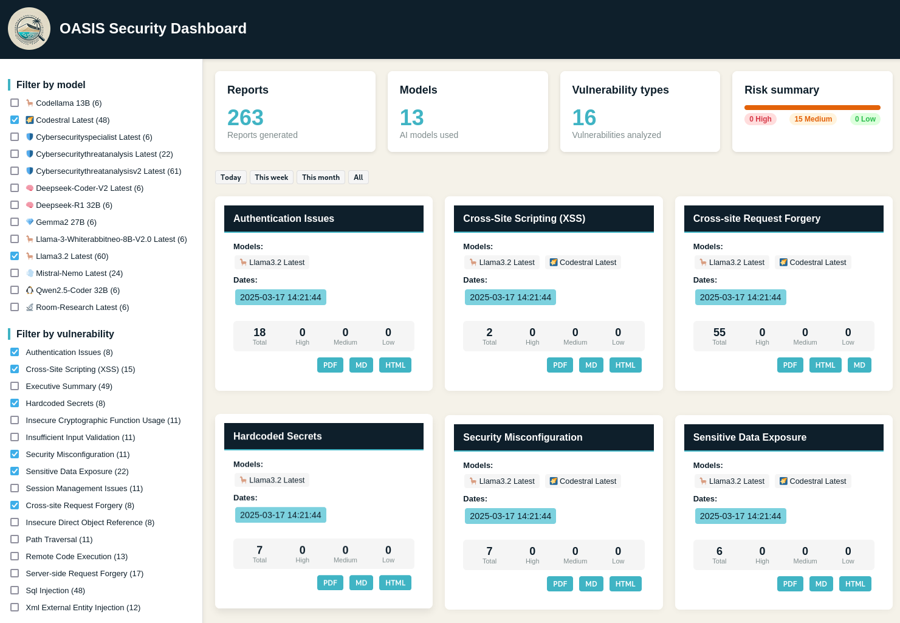

<p align="center">
  <a href="https://github.com/psyray/oasis/blob/main/LICENSE">
    
  </a>
  <a href="https://github.com/psyray/oasis/releases">
    
  </a>
  <a href="https://python.org">
    
  </a>
</p>

<div align="center">
  <a href="https://discord.gg/dW3sFwTtN3">
    
  </a>
</div>

<div align="center">
  <h1>OASIS</h1>
</div>
<p align="center">
  <small>🏝️ <strong>O</strong>llama <strong>A</strong>utomated <strong>S</strong>ecurity <strong>I</strong>ntelligence <strong>S</strong>canner</small>
</p>

<p align="center">
  
</p>

<p align="center">
  🛡️ An AI-powered security auditing tool that leverages Ollama models to detect and analyze potential security vulnerabilities in your code.
</p>

<p align="center">
  <em>Advanced code security analysis through the power of AI</em>
</p>

## 🌟 Features

- 🔍 **Multi-Model Analysis**: Leverage multiple Ollama models for comprehensive security scanning
- 🔄 **Two-Phase Scanning**: Use lightweight models for initial scanning and powerful models for deep analysis
- 🧠 **Adaptive Analysis**: Smart multi-level scanning that adjusts depth based on risk assessment
- 🔄 **Interactive Model Selection**: Guided selection of scan and analysis models with parameter-based filtering
- 💾 **Dual-Layer Caching**: Efficient caching for both embeddings and analysis results to dramatically speed up repeated scans
- 🔧 **Scan Result Caching**: Store and reuse vulnerability analysis results with model-specific caching
- 📊 **Rich Reporting**: Canonical JSON reports plus derived HTML, PDF, and Markdown exports
- 🔄 **Parallel Processing**: Optimized performance through parallel vulnerability analysis
- 📝 **Executive Summaries**: Clear overview of all detected vulnerabilities
- 🎯 **Customizable Scans**: Support for specific vulnerability types and file extensions
- 📈 **Distribution Analysis**: Advanced audit mode for embedding distribution analysis
- 🔄 **Content Chunking**: Intelligent content splitting for better analysis of large files
- 🤖 **Interactive Model Installation**: Guided installation for required Ollama models
- 🌐 **Web Interface**: Secure, password-protected web dashboard for exploring reports

## 🚀 Prerequisites

- Python 3.9+
- [Ollama](https://ollama.ai) installed and running
- pipx (for isolated installation)
  ```bash
  # On macOS
  brew install pipx
  pipx ensurepath

  # On Ubuntu/Debian
  python3 -m pip install --user pipx
  python3 -m pipx ensurepath

  # On Windows (with pip)
  pip install --user pipx
  python -m pipx ensurepath
  ```


## 🛠️ Hardware Requirements

### Minimum Requirements
- **CPU**: 4+ cores (Intel i5/AMD Ryzen 5 or better)
- **RAM**: 16 GB minimum, 32 GB recommended
- **Storage**: 100 GB+ free space for models (more for caching large codebases)
- **GPU**: Not required for basic usage (will use CPU but really slow)

### Recommended Setup
- **CPU**: 8+ cores (Intel i7/i9 or AMD Ryzen 7/9)
- **RAM**: 32 GB-64 GB for large codebases
- **GPU**: NVIDIA with 8 GB+ VRAM (RTX 3060 or better)
- **Storage**: SSD with 100 GB+ free space

### Scaling Guidelines
- **Small Projects** (< 10,000 Lines of Code (LOC)): Minimum requirements sufficient
- **Medium Projects** (10,000-100,000  Lines of Code (LOC)): 8-core CPU, 32 GB+ RAM recommended
- **Large Projects** (> 100,000 Lines of Code (LOC)): High-end CPU, 64 GB+ RAM, dedicated GPU essential

### GPU Recommendations by Model Size
- **4-8B parameter models**: 8 GB VRAM minimum
- **12-20B parameter models**: 16 GB VRAM recommended
- **30B+ parameter models**: 24 GB+ VRAM (RTX 3090/4090/A5000 or better)

### Network Requirements
- Stable internet connection for model downloads
- Initial model downloads: 3GB-15GB per model

### Performance Tips
- Use SSD storage for cache directories
- Prioritize GPU memory over compute performance
- Consider running overnight for large codebases
- For enterprise usage, dedicated server with 128GB+ RAM and A100/H100 GPU recommended


## 📦 Installation

1. Clone the repository:
```bash
git clone https://github.com/psyray/oasis.git
cd oasis
```

2. Install with pipx:
```bash
# First time installation
pipx install -e .
```

## 🔄 Update

If new releases are available, you can update the installation with:
```bash
git pull origin master
pipx upgrade oasis
```
**NOTE**: because of the editable installation, you just need to pull the latest changes from the repository to update your global **oasis** command installed with pipx.
So the pipx upgrade is not mandatory, only if needed to bump version in pipx

Or test a feature branch before official release (could be unstable)
```
git fetch --all
git checkout feat/vX.X
```

## 🗑️ Uninstallation
```bash
pipx uninstall oasis
```

## 🔧 Usage

Basic usage:
```bash
oasis --input [path_to_analyze]
```

## 🚀 Quick Test

To quickly test OASIS with sample files:
```bash
# Clone and install
git clone https://github.com/psyray/oasis.git
cd oasis
pipx install --editable .

# Run analysis on test files
oasis --input test_files/
```

This will analyze the provided test files and generate security reports in the parent directory of the folder to analyze, `security_reports`.

## 🔥 Advanced Usage Examples

Standard two-phase analysis with separate models:
```bash
# Use a lightweight model for initial scanning and a powerful model for deep analysis
oasis -i [path_to_analyze] -sm gemma3:4b -m gemma3:27b
```

Adaptive multi-level analysis:
```bash
# Use adaptive analysis mode with custom threshold
oasis -i [path_to_analyze] --adaptive -t 0.6 -m llama3
```

Targeted vulnerability scan with caching control:
```bash
# Analyze only for SQL Injection and XSS, clear cache, specify models
oasis -i [path_to_analyze] -v sqli,xss --clear-cache-scan -sm gemma3:4b -m gemma3:27b
```

Full production scan:
```bash
# Comprehensive scan of a large codebase
oasis -i [path_to_analyze] -sm gemma3:4b -m llama3:latest,codellama:latest -t 0.7 --vulns all
```

## 🎮 Command Line Arguments

### Input/Output Options
- `--input` `-i`: Path to file, directory, or .txt file containing newline-separated paths to analyze
- `--output-format` `-of`: Comma-separated formats or `all` for json, sarif, pdf, html, md (default: all)
- `--extensions` `-x`: Custom file extensions to analyze (e.g., "py,js,java")
- `--language` `-l`: Language for reports (default: en)  
  Supported: 🇬🇧 English (en), 🇫🇷 Français (fr), 🇪🇸 Español (es), 🇩🇪 Deutsch (de), 🇮🇹 Italiano (it), 🇵🇹 Português (pt), 🇷🇺 Русский (ru), 🇨🇳 中文 (zh), 🇯🇵 日本語 (ja)

### Analysis Configuration
- `--analyze-type` `-at`: Analyze type [standard, deep] (default: standard)
- `--embeddings-analyze-type` `-eat`: Analyze code by entire file or by individual functions [file, function] (default: file)
    - file: Performs the embedding on the entire file as a single unit, preserving overall context but potentially diluting details.  
    - function (**EXPERIMENTAL**): Splits the file into individual functions for analysis, allowing for more precise detection of issues within specific code blocks but with less contextual linkage across functions.  

- `--adaptive` `-ad`: Use adaptive multi-level analysis that adjusts depth based on risk assessment
- `--threshold` `-t`: Similarity threshold (default: 0.5)
- `--vulns` `-v`: Vulnerability types to check (comma-separated or 'all')
- `--chunk-size` `-ch`: Maximum size of text chunks for embedding (default: auto-detected)

### Model Selection
- `--models` `-m`: Comma-separated list of models to use for deep analysis
- `--scan-model` `-sm`: Model to use for quick scanning (default: same as main model)
- `--model-thinking` `-mt`: Enable/disable thinking for deep analysis models [yes,no] (default: no)
- `--small-model-thinking` `-smt`: Enable/disable thinking for the quick scan model [yes,no] (default: no)
- `--embed-model` `-em`: Model to use for embeddings (default: nomic-embed-text:latest)
- `--list-models` `-lm`: List available models and exit

### Cache Management
- `--clear-cache-embeddings` `-cce`: Clear embeddings cache before starting
- `--clear-cache-scan` `-ccs`: Clear scan analysis cache for the current analysis type
- `--cache-days` `-cd`: Maximum age in days for both embedding and analysis caches (default: 7)

### Web Interface
- `--web` `-w`: Serve reports via a web interface
- `--web-expose` `-we`: Web interface exposure (local: 127.0.0.1, all: 0.0.0.0) (default: local)
- `--web-password` `-wpw`: Web interface password (if not specified, a random password will be generated)
- `--web-port` `-wp`: Web interface port (default: 5000)

### Logging and Debug
- `--debug` `-d`: Enable debug output
- `--silent` `-s`: Disable all output messages

### Special Modes
- `--audit` `-a`: Run embedding distribution analysis
- `--ollama-url` `-ol`: Ollama URL (default: http://localhost:11434)
- `--version` `-V`: Show OASIS version and exit

## 💡 Getting the Most out of OASIS

### Model Selection Strategy

OASIS uses a two-phase scanning approach that leverages different models for optimal results:

#### Model Selection by Purpose
- **Initial Scanning Models** (4-7B parameters):
  - Optimized for speed: `gemma3:4b`, `llama3.2:3b`, `phi3:mini`
  - Used for quick pattern matching and identifying potentially suspicious code segments
  - Resource-efficient for scanning large codebases

- **Deep Analysis Models** (>20B parameters):
  - Optimized for thorough analysis: `gemma3:27b`, `deepseek-r1:32b`, `qwen2.5-coder:32b`, `mistral-nemo`, `mixtral:instruct`
  - Used only for code sections flagged as suspicious in the initial scan
  - Provides detailed vulnerability assessment

- **Specialized Code Models**:
  - Code-specific models: `codellama`, `codestral`, `starcoder`, `phind-codellama`
  - Best for specific languages and frameworks
  - `codellama` for general code, `codestral` for Python/C++, `starcoder/phind-codellama` for web technologies

#### Example Model Combinations

```bash
# For quick analysis of a small project
oasis -i ./src -sm llama3.2:3b -m llama3.2:8b

# For thorough analysis of web application code (PHP, JavaScript)
oasis -i ./webapp -sm gemma3:4b -m codellama:34b -v xss,sqli,csrf

# For security audit of Python backend with specialized models
oasis -i ./backend -sm phi3:mini -m deepseek-r1:32b,qwen2.5-coder:32b -v rce,input,data

# For critical infrastructure security analysis (most thorough)
oasis -i ./critical-service -sm gemma3:7b -m mixtral:instruct -v all --adaptive -t 0.6
```

### Scanning Workflows: Standard vs Adaptive

OASIS offers two different analysis approaches, each with distinct advantages:

#### Standard Two-Phase Workflow

This workflow uses a sequential approach with two distinct phases:

1. **Initial Scanning Phase**:
   - Uses a lightweight model specified by `-sm`
   - Scans entire codebase to identify potentially suspicious chunks
   - Creates a map of suspicious sections for deep analysis

2. **Deep Analysis Phase**:
   - Uses more powerful model(s) specified by `-m`
   - Analyzes only chunks flagged as suspicious in phase 1
   - Generates comprehensive analysis reports

**Best for**: Large codebases with uniform risk profiles, predictable resource planning

#### Adaptive Multi-Level Workflow

The adaptive workflow employs a dynamic approach that adjusts analysis depth based on risk assessment:

1. **Level 1**: Static pattern-based analysis (fastest)
2. **Level 2**: Lightweight model scan for initial screening
3. **Level 3**: Medium-depth context analysis with risk scoring
4. **Level 4**: Deep analysis only for high-risk chunks

**Best for**: Critical systems with varied risk profiles, complex codebases requiring nuanced analysis

#### Comparison Table

| Aspect | Standard Two-Phase | Adaptive Multi-Level |
|--------|-------------------|----------------------|
| **Speed** | Faster for average cases | Faster for low-risk code, slower overall |
| **Resource Usage** | Predictable, efficient | Variable, optimized for risk |
| **Detection Accuracy** | Good for obvious vulnerabilities | Better for subtle, context-dependent issues |
| **False Positives** | More common | Reduced through context analysis |
| **Resource Allocation** | Fixed per phase | Dynamically adjusted by risk |
| **Command Flag** | Default | Use `--adaptive` `-ad` |

### Optimization Tips

For the best results with OASIS:

1. **Caching Strategy**:
   - Leverage the dual-layer caching system for repeated scans
   - Only clear embedding cache (`-cce`) when changing embedding models or after major code changes
   - Clear scan cache (`-ccs`) when upgrading to better models or after fixing vulnerabilities

2. **Workflow Optimization**:
   - Start with higher thresholds (0.7-0.8) for large codebases to focus on high-probability issues
   - Use `--audit` mode to understand vulnerability distribution before full analysis
   - Specify relevant vulnerability types (`-v`) and file extensions (`-x`) to target your analysis

3. **Resource Management**:
   - For large projects, run initial scans during off-hours
   - Balance CPU/GPU usage by choosing appropriate model sizes
   - Use model combinations that maximize speed and accuracy based on your hardware

4. **Report Utilization**:
   - View HTML reports for the best interactive experience
   - Use the web interface (`--web`) for team collaboration
   - Export PDF reports for documentation and sharing

## 🛡️ Supported Vulnerability Types

| Tag | Description |
|-----|-------------|
| `sqli` | SQL Injection |
| `xss` | Cross-Site Scripting |
| `input` | Insufficient Input Validation |
| `data` | Sensitive Data Exposure |
| `session` | Session Management Issues |
| `config` | Security Misconfiguration |
| `logging` | Sensitive Data Logging |
| `crypto` | Insecure Cryptographic Function Usage |
| `rce` | Remote Code Execution |
| `ssrf` | Server-Side Request Forgery |
| `xxe` | XML External Entity |
| `pathtra` | Path Traversal |
| `idor` | Insecure Direct Object Reference |
| `auth` | Authentication Issues |
| `csrf` | Cross-Site Request Forgery |
| `cmdi` | Command Injection |
| `cors` | CORS Misconfiguration |
| `debug` | Debug Information Exposure |
| `deser` | Insecure Deserialization |
| `jwt` | JWT Implementation Flaws |
| `lfi` | Local File Inclusion |
| `redirect` | Open Redirect |
| `rfi` | Remote File Inclusion |
| `secrets` | Hardcoded Secrets |
| `upload` | File Upload Vulnerabilities |

## 📁 Output Structure

Vulnerability runs are stored under a timestamped directory. For each model, per-format folders include a **canonical JSON** report (`json/*.json`) used by the web dashboard for statistics and previews. Chunk objects may include **`start_line` / `end_line`** (1-based inclusive bounds for the analyzed source segment, computed at split time, not inferred by the model). Each finding may include **`snippet_start_line` / `snippet_end_line`** when the tool can match `vulnerable_code` inside that chunk (otherwise SARIF falls back to the chunk span). **SARIF 2.1.0** (`sarif/*.sarif`) is generated from the same document for toolchains (DefectDojo, SonarQube, IDE SARIF viewers) and maps those spans to `region.startLine` / `region.endLine` when available. HTML and PDF are rendered from that JSON via Jinja2; Markdown is an additional human-readable export.

```
security_reports/
└── [input_basename]_YYYYMMDD_HHMMSS/
    ├── logs/
    │   └── oasis_errors_[run_id].log
    └── [sanitized_model_name]/
        ├── json/
        │   └── vulnerability_type.json
        ├── sarif/
        │   └── vulnerability_type.sarif
        ├── md/
        │   └── vulnerability_type.md
        ├── html/
        │   └── vulnerability_type.html
        └── pdf/
            └── vulnerability_type.pdf
```

### Ollama structured outputs

Deep and scan analysis calls use Ollama **structured outputs** (`format` with a JSON schema). Use a recent Ollama server; model quality still varies by GGUF. If structured validation fails, the analyzer falls back to safe defaults or regex (function extraction only).

### Structured output hardening

Use this priority order to reduce invalid JSON responses (`Field required`, `json_invalid`, `EOF while parsing a string`):

1. **Model selection first**
   - Choose a scan model that is stable with strict JSON outputs.
   - Keep a deep model only if it stays stable across repeated runs on the same corpus.
   - Compare candidates with the same target files and track invalid JSON rate + average chunk latency.
2. **Ollama generation settings**
   - Keep conservative generation settings for structured scan/deep calls.
   - Keep thinking disabled for strict JSON runs unless a model explicitly requires it.
   - Ensure chunk size and model context window are compatible to avoid truncated outputs.
3. **Targeted retry policy**
   - Retry only known structured failures: missing required `verdict` (scan) and invalid/truncated JSON (`json_invalid`, `EOF while parsing`) for deep responses.
   - Keep retries bounded (scan: up to 2 retries, deep: up to 1 retry) and append a strict JSON correction reminder on retries.
   - Keep final fallback behavior deterministic when retries fail.
4. **Operational safeguards**
   - Track invalid JSON ratio per run and alert when it exceeds your acceptance threshold.
   - Review `security_reports/<run_id>/logs/oasis_errors_<run_id>.log` after each scan to identify the failing model/phase/chunk quickly.

Each structured-output error log line includes context fields such as run identifier, model, phase, vulnerability (if available), file path, chunk index, exception type, and a truncated raw preview.
Retry-aware logs also include `retry_attempt` and `retry_max` so you can distinguish first failure from final fallback.

Example hardened command:

```bash
oasis -i ./critical-service -sm qwen2.5-coder:7b -m bugtraceai-apex-q4 --adaptive -t 0.6 -smt no -mt no
```

### Web dashboard and Reload

- Statistics and risk summaries are read from **`json/*.json`**.
- **Reload** refreshes both `/api/stats?force=1` and `/api/reports?force=1` so listings stay in sync with the filesystem.
- Canonical JSON reports are previewed in the Web UI by rendering HTML from the JSON via the Jinja template, so the modal matches the HTML/PDF structure as closely as possible.
- Markdown preview (`/api/report-content/...`) remains the fallback for legacy reports that do not have a sibling `json/<same-stem>.json`, or when canonical JSON HTML preview cannot be generated.

## 💾 Cache Management

OASIS implements a sophisticated dual-layer caching system to optimize performance:

### Embedding Cache
- Stores vector embeddings of your codebase to avoid recomputing them for repeated analyses
- Default cache duration: 7 days
- Cache location: `.oasis_cache/[embedding_model_name]/`
- Use `--clear-cache-embeddings` (`-cce`) to force regeneration of embeddings

### Analysis Cache
- Stores the results of LLM-based vulnerability scanning for each model and analysis mode
- Separate caches for scan (lightweight) and deep analysis results
- Model-specific caching ensures results are tied to the specific model used
- Analysis type-aware (standard vs. adaptive)
- Use `--clear-cache-scan` (`-ccs`) to force fresh vulnerability scanning

This dual-layer approach dramatically improves performance:
- First-time analysis: Compute embeddings + full scanning
- Repeated analysis (same code): Reuse embeddings + scanning results
- After code changes: Update only changed file embeddings + scan only modified components

The cache system intelligently handles:
- Different model combinations (scan model + deep model)
- Different analysis types and modes
- Different vulnerability types
- Cache expiration based on configured days

For the best performance:
- Only clear the embedding cache when changing embedding models or after major code changes
- Clear the scan cache when upgrading to a newer/better model or after fixing vulnerabilities

## 📊 Audit Mode

OASIS offers a specialized Audit Mode that performs an embedding distribution analysis to help you understand your codebase's vulnerability profile before conducting a full scan.

```bash
# Run OASIS in audit mode
oasis --input [path_to_analyze] --audit
```

### What Audit Mode Does

- **Embedding Analysis**: Generates embeddings for your entire codebase and all vulnerability types
- **Similarity Distribution**: Calculates similarity scores between your code and various vulnerability patterns
- **Threshold Analysis**: Shows the distribution of similarity scores across different thresholds
- **Statistical Overview**: Provides mean, median, and max similarity scores for each vulnerability type
- **Top Matches**: Identifies the files or functions with the highest similarity to each vulnerability type

### Benefits of Audit Mode

- **Pre-Scan Intelligence**: Understand which vulnerability types are most likely to be present in your codebase
- **Threshold Optimization**: Determine the optimal similarity threshold for your specific project
- **Resource Planning**: Identify which vulnerabilities require deeper analysis with more powerful models
- **Faster Insights**: Get a quick overview without running a full security analysis
- **Targeted Scanning**: Use the results to focus your main analysis on the most relevant vulnerability types

### Example Workflow

1. **Initial Audit**: 
   ```bash
   oasis -i [path_to_analyze] --audit
   ```

2. **Targeted Analysis** based on audit results:
   ```bash
   oasis -i [path_to_analyze] -v sqli,xss,rce -t 0.65
   ```

The Audit Mode is especially valuable for large codebases where a full scan might be time-consuming, allowing you to make informed decisions about where to focus your security analysis efforts.

## 🌐 Web Interface

OASIS includes a web interface to view and explore security reports:



<br>

```bash
# Start the web interface with default settings (localhost:5000)
oasis --input [path_to_analyze] --web

# Start with custom port and expose to all network interfaces
oasis --input [path_to_analyze] --web --web-port 8080 --web-expose all

# Start with a specific password
oasis --input [path_to_analyze] --web --web-password mysecretpassword
```

### Security Features

- **Password Protection**: By default, a random password is generated and displayed in the console
- **Network Isolation**: By default, the server only listens on 127.0.0.1
- **Custom Port**: Configurable port to avoid conflicts with other services

When no password is specified, a secure random password will be generated and displayed in the console output. The web interface provides a dashboard to explore security reports, filter results, and view detailed vulnerability information.

## 📝 Changelog

See [CHANGELOG.md](CHANGELOG.md) for the latest updates and changes.

## 🤝 Contributing

Contributions are welcome! Please feel free to submit a Pull Request. Check out our [Contributing Guidelines](CONTRIBUTING.md) for more details.

Alternatively, you can also contribute by reporting issues or suggesting features.

Come and join our [Discord server](https://discord.gg/dW3sFwTtN3) to discuss the project.

## 📄 License

[GPL v3](LICENSE) - feel free to use this project for your security needs.

## 🙏 Acknowledgments

- Built with [Ollama](https://ollama.ai)
- Uses [WeasyPrint](https://weasyprint.org/) for PDF generation
- Uses [Jinja2](https://jinja.palletsprojects.com/) for report templating
- Special thanks to all contributors and the open-source community

## 📫 Support

If you encounter any issues or have questions, come asking help on our [Discord server](https://discord.gg/dW3sFwTtN3) or please file an issue.