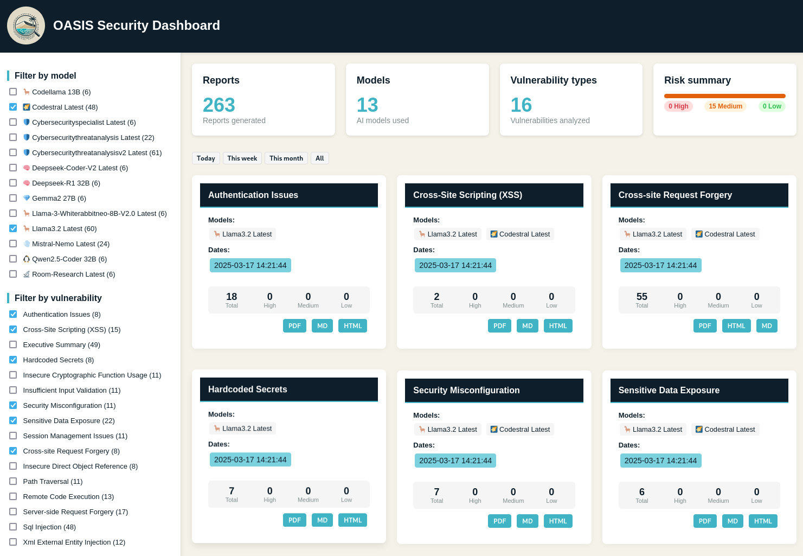

<p align="center">
  <a href="https://github.com/psyray/oasis/blob/main/LICENSE">
    
  </a>
  <a href="https://github.com/psyray/oasis/releases">
    
  </a>
  <a href="https://python.org">
    
  </a>
</p>

<div align="center">
  <a href="https://discord.gg/dW3sFwTtN3">
    
  </a>
</div>

<div align="center">
  <h1>OASIS</h1>
</div>
<p align="center">
  <small>🏝️ <strong>O</strong>pen <strong>A</strong>utomated <strong>S</strong>ecurity <strong>I</strong>ntelligence <strong>S</strong>canner</small>
</p>

<p align="center">
  
</p>

<p align="center">
  🛡️ An AI-powered security auditing tool that leverages local LLMs (Ollama, or any OpenAI-compatible server: vLLM, LiteLLM, LM Studio…) to detect and analyze potential security vulnerabilities in your code.
</p>

<p align="center">
  <em>Advanced code security analysis through the power of AI</em>
</p>

<a id="readme-contents"></a>

## 📑 Table of contents

| Section | Topics |
|---------|--------|
| [Features](#readme-features) | Highlights, dashboard, canonical reports |
| [Finding Validation Principle](#readme-finding-validation-principle) | Deterministic verdict, scope anchoring, narrative guardrails |
| [Getting started](#readme-getting-started) | Prerequisites, pipx install, Docker (quick), maintenance |
| [Hardware Requirements](#readme-hardware) | CPUs, GPU, scaling |
| [Advanced Usage Examples](#readme-advanced-usage-examples) | Example CLI invocations |
| [Command Line Arguments](#readme-command-line-args) | Flags, web/assistant options, streaming |
| [CI integration](#readme-ci-integration) | `--fail-on` gate, exit codes, GitHub Actions example |
| [Model providers](#readme-model-providers) | Ollama / OpenAI-compatible backends (vLLM, LM Studio...) |
| [Getting the Most out of OASIS](#readme-best-practices) | Models, LangGraph workflow, tips |
| [Supported Vulnerability Types](#readme-vuln-types) | Type tags reference table |
| [Output Structure](#readme-output-structure) | `security_reports/`, project slug, canonical JSON |
| [Run with Docker](#readme-docker) | Compose, `docker run`, web from container |
| [Cache Management](#readme-cache) | Embeddings and scan caches |
| [Audit Mode](#readme-audit) | Pre-scan audit, structured `audit_report.json` |
| [Suppression registry](#readme-suppressions) | Fingerprint registry, SARIF suppressions, candidates |
| [Inline ignore markers](#readme-inline-ignore) | `#oasisignore` / `#noqa`-style source markers dropped before reports |
| [Scan diff](#readme-scan-diff) | `--diff-against` baseline comparison, new/fixed/persistent |
| [Consolidated report](#readme-consolidated) | `-rm` multi-model merge, fingerprint groups, LLM narrative |
| [Web Interface](#readme-web) | `--web`, security |
| [Changelog](#readme-changelog) | Release notes |
| [Contributing](#readme-contributing) | PRs and issues |
| [License](#readme-license) | GPL v3 |
| [Acknowledgments](#readme-acknowledgments) | Credits |
| [Support](#readme-support) | Discord / issues |

<p align="right"><a href="#readme-contents">↑ Back to contents</a></p>

<a id="readme-features"></a>

## 🌟 Features

- 🤖 **Dashboard assistant**: In the report modal, the AI assistant triages **single-vulnerability JSON** reports or **executive / scan-wide** mode (aggregated JSON under the run) with optional **RAG** over the local embedding cache, a **chat model** selector (Ollama tags), **Markdown** replies, persisted **chat sessions** keyed by the canonical report path, and configurable Ollama/RAG flags (`--web-ollama-url`, `--web-embed-model`, `--web-assistant-rag`)
- ⏳ **Multi-model scan progress**: the dashboard Scan progress card renders an **Overall** tab (aggregate bar + `X/N models complete`) plus one tab per deep model — emoji + display name, with current (⏳) / done (✓) / pending (grayed) states and per-model phase rows; multi-model runs can no longer stick to the first model's completion
- 🛡️ **Finding validation agent**: Findings are **validated automatically during the scan** — a deterministic, code-driven investigation (entry points, call chains, taint flows, on-path mitigations) embeds an exploitability verdict with confidence in every report, shown as color-coded badges. In the dashboard, the assistant panel exposes the full evidence per finding via a single finding picker or the **Ask AI** buttons in the Detailed analysis section; a manual `POST /api/assistant/investigate` re-validation with optional LLM narrative stays available and is constrained to stay consistent with the deterministic result. See [Finding Validation Principle](#readme-finding-validation-principle) for full behavior and guardrails.
- 🔍 **Multi-Model Analysis**: Leverage multiple Ollama models for comprehensive security scanning
- 🤝 **OpenAI-compatible backends**: Run the same pipeline against **vLLM**, LM Studio, llama.cpp server, LocalAI, ... via `--provider openai --api-base URL`
- 🔄 **Two-Phase Scanning**: Use lightweight models for initial scanning and powerful models for deep analysis
- 🧠 **LangGraph Orchestration**: Single pipeline (discover → scan → expand → deep → verify → report, optional PoC assist) with bounded context-expand retries
- 🔄 **Interactive Model Selection**: Guided selection of scan and analysis models with parameter-based filtering
- 💾 **Dual-Layer Caching**: Efficient caching for both embeddings and analysis results to dramatically speed up repeated scans
- 🔧 **Scan Result Caching**: Store and reuse vulnerability analysis results with model-specific caching
- 📊 **Rich Reporting**: Canonical JSON reports plus derived HTML, PDF, and Markdown exports
- 🔄 **Parallel Processing**: Optimized performance through parallel vulnerability analysis
- 📝 **Executive summaries**: Structured **canonical JSON** with overview KPIs, tier context, similarity highlights, and matching dashboard/modal HTML (TOC, anchors, charts); generation starts during the scan and updates as phases complete (**live progress** during long runs)
- 🎯 **Customizable Scans**: Support for specific vulnerability types and file extensions
- 📈 **Distribution / audit mode**: Embedding-based similarity audit before a full scan; with JSON in your output formats you get **`audit_report.json`** (and Markdown) with the same facts—the dashboard reads it for **comparison tables** and **HTML preview** in the report modal when available.
- 🔄 **Content Chunking**: Intelligent content splitting for better analysis of large files
- 🤖 **Interactive Model Installation**: Guided installation for required Ollama models
- 🌐 **Web Interface**: Secure, password-protected web dashboard for exploring reports
- ⚡ **Incremental Reporting**: Vulnerability reports are published as soon as each vulnerability analysis completes
- 🎚️ **Dashboard filters**: Narrow listings by **project**, **severity** (tier bands), model, and date; report modal **JSON/HTML/content** previews stay within the active filter set
- 🌗 **Web UI themes**: **Light/dark** toggle in the header; Chart.js severity rollups follow the selected theme
- 📁 **Project grouping**: Optional **`--project-name` / `-pn`** for **`security_reports/`** layout and dashboard filters ([Output structure](#readme-output-structure))

<p align="right"><a href="#readme-contents">↑ Back to contents</a></p>

<a id="readme-getting-started"></a>

## 🚀 Getting started

### Prerequisites

- **Python** 3.9+
- **[Ollama](https://ollama.ai)** installed and running; pull the models you need before scanning.
- **[pipx](https://pypa.github.io/pipx/)** (recommended CLI install):

```bash
# macOS
brew install pipx
pipx ensurepath

# Ubuntu/Debian
python3 -m pip install --user pipx
python3 -m pipx ensurepath

# Windows (with pip)
pip install --user pipx
python -m pipx ensurepath
```

### Standard run (pipx)

```bash
git clone https://github.com/psyray/oasis.git
cd oasis
pipx install -e .

oasis --input test_files/
```

Reports are written under **`security_reports/`** beside the path you analyze (see [Output structure](#readme-output-structure)).

### Docker (optional)

From the repository root, with Ollama on the host:

```sh
docker compose build
docker compose run --rm oasis -i /work/test_files -ol http://host.docker.internal:11434
```

Code is mounted at **`/work`**; use `-i` paths under `/work`. More options (bundled Ollama, dashboard, `docker run`) are in [Run with Docker](#readme-docker).

### Maintenance

**Update from GitHub releases** (recommended when you installed from tags / non-editable):

```bash
oasis --check-update   # compare installed version vs latest stable release on GitHub
oasis --self-update    # reinstall latest stable via pipx (requires pipx on PATH)
```

Stable releases only: GitHub entries marked pre-release are ignored. To skip the occasional “update available” line on stderr, set `OASIS_NO_UPDATE_CHECK=1`. For unexpected banner failures, set `OASIS_DEBUG_UPDATE` to `1`, `true`, or `yes` to print a short diagnostic on stderr (developer troubleshooting).

**Editable / development clone** — after `git pull`, your editable pipx install tracks the repo:

```bash
git pull origin master
pipx upgrade oasis
```

(`pipx upgrade` is optional for editable installs; use it when you want pipx’s recorded version to match.)

**Uninstall**

```bash
pipx uninstall oasis
```

**Feature branches** (optional, may be unstable):

```bash
git fetch --all
git checkout feat/vX.X
```

<p align="right"><a href="#readme-contents">↑ Back to contents</a></p>

<a id="readme-hardware"></a>

## 🛠️ Hardware Requirements

### Minimum Requirements
- **CPU**: 4+ cores (Intel i5/AMD Ryzen 5 or better)
- **RAM**: 16 GB minimum, 32 GB recommended
- **Storage**: 100 GB+ free space for models (more for caching large codebases)
- **GPU**: Not required for basic usage (will use CPU but really slow)

### Recommended Setup
- **CPU**: 8+ cores (Intel i7/i9 or AMD Ryzen 7/9)
- **RAM**: 32 GB-64 GB for large codebases
- **GPU**: NVIDIA with 8 GB+ VRAM (RTX 3060 or better)
- **Storage**: SSD with 100 GB+ free space

### Scaling Guidelines
- **Small Projects** (< 10,000 Lines of Code (LOC)): Minimum requirements sufficient
- **Medium Projects** (10,000-100,000  Lines of Code (LOC)): 8-core CPU, 32 GB+ RAM recommended
- **Large Projects** (> 100,000 Lines of Code (LOC)): High-end CPU, 64 GB+ RAM, dedicated GPU essential

### GPU Recommendations by Model Size
- **4-8B parameter models**: 8 GB VRAM minimum
- **12-20B parameter models**: 16 GB VRAM recommended
- **30B+ parameter models**: 24 GB+ VRAM (RTX 3090/4090/A5000 or better)

### Network Requirements
- Stable internet connection for model downloads
- Initial model downloads: 3GB-15GB per model

### Performance Tips
- Use SSD storage for cache directories
- Prioritize GPU memory over compute performance
- Consider running overnight for large codebases
- For enterprise usage, dedicated server with 128GB+ RAM and A100/H100 GPU recommended

<p align="right"><a href="#readme-contents">↑ Back to contents</a></p>

<a id="readme-advanced-usage-examples"></a>

## 🔥 Advanced Usage Examples

Standard two-phase analysis with separate models:
```bash
# Use a lightweight model for initial scanning and a powerful model for deep analysis
oasis -i [path_to_analyze] -sm gemma3:4b -m gemma3:27b
```

LangGraph pipeline (default) with optional PoC hints and expand budget:
```bash
# Same two-model setup; optional: cap context-expand retries, PoC hint bullets, and/or LLM PoC text
oasis -i [path_to_analyze] -t 0.6 -m llama3 --langgraph-max-expand 2 --poc-hints
```

Targeted vulnerability scan with caching control:
```bash
# Analyze only for SQL Injection and XSS, clear cache, specify models
oasis -i [path_to_analyze] -v sqli,xss --clear-cache-scan -sm gemma3:4b -m gemma3:27b
```

Full production scan:
```bash
# Comprehensive scan of a large codebase
oasis -i [path_to_analyze] -sm gemma3:4b -m llama3:latest,codellama:latest -t 0.7 --vulns all
```

<p align="right"><a href="#readme-contents">↑ Back to contents</a></p>

<a id="readme-command-line-args"></a>

## 🎮 Command Line Arguments

### Input/Output Options
- `--input` `-i`: Path to file, directory, or .txt file containing newline-separated paths to analyze
- `--project-name` `-pn`: Optional project alias for report grouping/filtering (overrides the name derived from `-i`; allowed chars: `A-Z`, `a-z`, `0-9`, `_`, `-`)
- **`--diff-against` `PATH`**: Write a **scan diff report** comparing this run with a baseline run — new / fixed / persistent findings plus severity changes. See [Scan diff](#readme-scan-diff).
- `--output-format` `-of`: Comma-separated formats or `all` for json, sarif, pdf, html, md (default: all)
- `--extensions` `-x`: Custom file extensions to analyze (e.g., "py,js,java")
- `--language` `-l`: Language for reports (default: en)  
  Supported: 🇬🇧 English (en), 🇫🇷 Français (fr), 🇪🇸 Español (es), 🇩🇪 Deutsch (de), 🇮🇹 Italiano (it), 🇵🇹 Português (pt), 🇷🇺 Русский (ru), 🇨🇳 中文 (zh), 🇯🇵 日本語 (ja)

### Analysis Configuration

- **Removed flags:** `--adaptive`/`-ad` and `--analyze-type`/`-at` were dropped in favor of LangGraph-only orchestration; the CLI exits with guidance if they appear—use the options below and `-eat` for embedding segmentation instead.

- `--embeddings-analyze-type` `-eat`: Analyze code by entire file or by individual functions [file, function] (default: file)
    - file: Performs the embedding on the entire file as a single unit, preserving overall context but potentially diluting details.  
    - function (**EXPERIMENTAL**): Splits the file into individual functions for analysis, allowing for more precise detection of issues within specific code blocks but with less contextual linkage across functions.  

- **`--langgraph-max-expand`** `N`: Maximum **context-expand** retries after verify detects structured-output problems (default: **2**).
- **`--validate-findings`** / **`--no-validate-findings`**: Run the deterministic finding validation **automatically during the scan** and embed the verdicts in the reports (default: **on**). Findings are validated per `(file, line)` anchor with verdict deduplication; the dashboard can still run a live investigation per finding for full evidence.
- **`--validate-findings-budget`** `SEC`: Total wall-clock budget (seconds) for scan-time finding validation per scan (default: **120**). Findings past the budget stay unannotated and remain validatable on demand from the dashboard.
- **`--validate-findings-narrative`**: Additionally generate a **thinking-enabled LLM narrative** for each scan-time verdict (uses the deep model, stored in the `finding_validations.json` sidecar; off by default — increases scan time). Narrative reasoning is captured as collapsible thought segments in the dashboard; verdicts with no signal to explain (`insufficient_signal`, `error`) are skipped, and the narrative phase shares the same wall-clock budget.
- **`--poc-hints`**: Log optional high-level PoC hint bullets from structured findings only (**no** extra LLM call; **does not** run code).
- **`--poc-assist`**: Ask the deep model for a standalone executable PoC (script or commands) from findings; **logged only** — OASIS does not run generated code.
- **`--custom-instructions`**: Extra text appended to deep-analysis and **`--poc-assist`** prompts (merged with the file variant below; does **not** inject into the dashboard assistant system prompt—the assistant uses the canonical report JSON and optional RAG).
- **`--custom-instructions-file`**: UTF-8 file merged with **`--custom-instructions`** (file first, then inline text).
- `--threshold` `-t`: Similarity threshold (default: 0.5)
- **`--suppressions-file` `PATH`**: JSON registry of suppressed finding fingerprints; matching findings are exported with a native **SARIF suppressions** entry. See [Suppression registry](#readme-suppressions).
- **`--write-suppression-candidates`**: Write `suppression_candidates.json` in the run output listing every finding fingerprint to copy into a registry.
- **`--inline-ignore`** / **`--no-inline-ignore`**: Honor inline ignore markers on source lines (e.g. `# noqa`, `# oasisignore`) and drop annotated findings before validation and reports (default: **on**). See [Inline ignore markers](#readme-inline-ignore).
- **`--inline-ignore-tokens`** `CSV`: Comma-separated ignore markers to honor (default: `oasisignore,nosec,noqa,nosemgrep`).
- **`--fail-on` `SEVERITY`**: Exit with code **3** when the run reports findings at or above this severity [critical, high, medium, low] (case-insensitive). See [CI integration](#readme-ci-integration).
- `--vulns` `-v`: Vulnerability types to check (comma-separated or 'all')
- `--chunk-size` `-ch`: Maximum size of text chunks for embedding (default: auto-detected)

### Model Selection
- `--models` `-m`: Comma-separated list of models to use for deep analysis
- `--scan-model` `-sm`: Model to use for quick scanning (default: same as main model)
- `--model-thinking` `-mt`: Enable/disable thinking for deep analysis models [yes,no] (default: no)
- `--small-model-thinking` `-smt`: Enable/disable thinking for the quick scan model [yes,no] (default: no)
- `--embed-model` `-em`: Embedding model(s); in audit mode, supports a comma-separated list (example: `-em nomic-embed-text,bge-m3`) (default: nomic-embed-text)
- `--list-models` `-lm`: List available models and exit
- **`--provider`**: Model backend — `ollama` (native API, auto-pull) or `openai` (OpenAI-compatible server: vLLM, LM Studio, llama.cpp, LocalAI...) (default: `ollama`, env `OASIS_LLM_PROVIDER`)
- **`--api-base`**: Base URL of the OpenAI-compatible server, e.g. `https://llm.example.com/v1` (default: `http://localhost:8000/v1`, env `OASIS_OPENAI_BASE_URL`)
- **`--api-key`**: API key for the OpenAI-compatible server (default: env `OASIS_OPENAI_API_KEY`, else `local`; never logged).
- **`--embed-provider`**: Embedding backend — `ollama` (native API) or `openai` (OpenAI-compatible embedding server: vLLM, llama.cpp, LiteLLM...). Default: **inherits the chat backend** (`--provider`), so chat and embedding workloads can still be routed to separate servers with an explicit flag (env `OASIS_EMBED_PROVIDER`). See [Model providers](#readme-model-providers).
- **`--embed-api-base`**: Base URL of the OpenAI-compatible embedding server (default: inherited from `--api-base`; env `OASIS_EMBED_OPENAI_BASE_URL`).
- **`--embed-api-key`**: API key for the OpenAI-compatible embedding server (default: inherited from `--api-key`; env `OASIS_EMBED_OPENAI_API_KEY`; never logged).
- **`--report-model`** `-rm`: Consolidation model — after a multi-model run, merge the per-model findings into one consolidated report (deterministic fingerprint groups; the model synthesizes the narrative). See [Consolidated multi-model report](#readme-consolidated).

See [Model providers](#readme-model-providers) for details and per-server examples.

### Cache Management
- `--clear-cache-embeddings` `-cce`: Clear embeddings cache before starting
- `--clear-cache-scan` `-ccs`: Clear scan analysis cache for the current analysis type
- `--cache-days` `-cd`: Maximum age in days for both embedding and analysis caches (default: 7)

### Web Interface
- `--web` `-w`: Serve reports via a web interface
- `--web-expose` `-we`: Web interface exposure (local: 127.0.0.1, all: 0.0.0.0) (default: local)
- `--web-password` `-wpw`: Web interface password (if not specified, a random password will be generated)
- `--web-port` `-wp`: Web interface port (default: 5000)
- **`--web-ollama-url`**: Ollama HTTP API URL for the in-dashboard assistant (overridden by `OASIS_WEB_OLLAMA_URL`, otherwise same as `--ollama-url`).
- **`--web-provider`**: Model backend for the dashboard assistant (default: same as `--provider`, env `OASIS_WEB_LLM_PROVIDER`).
- **`--web-api-base`**: OpenAI-compatible base URL for the dashboard assistant (default: same as `--api-base`, env `OASIS_WEB_OPENAI_BASE_URL`).
- **`--web-api-key`**: API key for the dashboard assistant backend (default: same as `--api-key`, env `OASIS_WEB_OPENAI_API_KEY`).
- **`--web-embed-model`**: Embedding model for optional RAG over the local `.oasis_cache` pickle (defaults to the report’s `embed_model` or `nomic-embed-text`).
- **`--web-embed-provider`**: Embedding backend for assistant RAG queries (default: same as `--embed-provider`, else the chat backend; env `OASIS_WEB_EMBED_PROVIDER`).
- **`--web-embed-api-base`**: OpenAI-compatible base URL for assistant RAG embeddings (default: same as `--embed-api-base`, else the chat `--web-api-base`; env `OASIS_WEB_EMBED_OPENAI_BASE_URL`).
- **`--web-embed-api-key`**: API key for assistant RAG embeddings (default: same as `--embed-api-key`, else the chat `--web-api-key`; env `OASIS_WEB_EMBED_OPENAI_API_KEY`).
- **`--web-assistant-rag` / `--no-web-assistant-rag`**: Use embedding-cache retrieval in assistant answers (default: on).

For **JSON** reports, the dashboard modal includes an **Assistant** panel (triage, codebase context). Optional 0-based file/chunk/finding indices focus the model on one structured finding; RAG uses the same project root and cache file as the scan when available.

Assistant replies are rendered as **Markdown** (sanitized HTML). Model “thinking” sections wrapped in tags such as `<think>…</think>` are stripped from the visible answer and shown in collapsible blocks when present.

**Chat persistence** stores each conversation under `security_reports/<project_slug>/<run_timestamp>/.../json/.../<report>.json` in a sibling `chat/` folder (one JSON file per session). The UI can resume the latest session, start a new chat, or delete saved sessions. Data stays on the server filesystem next to your reports (no separate database). REST endpoints: `GET /api/assistant/sessions`, `GET /api/assistant/session`, `POST /api/assistant/chat`, **`POST /api/assistant/chat-stream`** (NDJSON progressive replies—the UI falls back to `POST /api/assistant/chat` when streaming is unavailable), `POST /api/assistant/session-branch`, `DELETE /api/assistant/session`, `DELETE /api/assistant/sessions`. Scan-time verdicts are served from a sibling **`finding_validations.json`** sidecar via `GET /api/assistant/finding-validations?report_path=…` (with `finding_scope_report_path=…` in executive aggregate mode) and also feed the chat system prompt when no session validation exists.

### Logging and Debug
- `--debug` `-d`: Enable debug output
- `--silent` `-s`: Disable all output messages

### Special Modes
- `--audit` `-a`: Run embedding distribution analysis
- `--ollama-url` `-ol`: Ollama URL (default: http://localhost:11434; used when `--provider` is `ollama`)
- `--version` `-V`: Show OASIS version and exit

### Environment overrides (advanced)

Optional **`OASIS_*`** variables tune timeouts and heuristic budgets without editing code (see `oasis/config.py` for the full list). Examples:

- **`OASIS_LLM_PROVIDER`** — default model backend (`ollama` | `openai`) when `--provider` is not set.
- **`OASIS_OPENAI_BASE_URL`** — OpenAI-compatible base URL when `--api-base` is not set.
- **`OASIS_OPENAI_API_KEY`** — API key for OpenAI-compatible servers (never logged).
- **`OASIS_OPENAI_CTX_TOKENS`** — declared context window (tokens) of OpenAI-compatible models; used for chunk sizing and assistant budget (the OpenAI protocol does not expose it).
- **`OASIS_OPENAI_STRUCTURED_OUTPUT`** — `auto` (default: send `response_format` JSON schema, fall back to schema-in-prompt on HTTP 4xx), `on` (always send, surface errors), `off` (schema-in-prompt only).
- **`OASIS_OPENAI_THINKING_KWARGS`** — `auto` (default: translate the `-mt`/`-smt` thinking flags into vLLM-style `chat_template_kwargs.enable_thinking`, retry without it on HTTP 4xx), `on` (always translate, surface errors), `off` (never send — strict servers).
- **`OASIS_EMBED_PROVIDER`** — embedding backend (`ollama` | `openai`); defaults to the chat backend configuration when unset.
- **`OASIS_EMBED_OPENAI_BASE_URL`** / **`OASIS_EMBED_OPENAI_API_KEY`** — embedding server settings when the embedding provider is `openai`.
- **`OASIS_WEB_EMBED_PROVIDER`** / **`OASIS_WEB_EMBED_OPENAI_BASE_URL`** / **`OASIS_WEB_EMBED_OPENAI_API_KEY`** — dashboard assistant RAG embeddings (fall back to the scan-side embedding backend, then the chat backend).
- **`OASIS_WEB_OLLAMA_URL`** — Ollama base URL for the dashboard assistant when `--web-ollama-url` is not set.
- **`OASIS_CHUNK_ANALYZE_TIMEOUT_SEC`** — server-side deadline for one Ollama generate call (seconds).
- **`OASIS_CHUNK_DEEP_NUM_PREDICT`** — cap on structured deep output tokens (`num_predict`).
- **`OASIS_OLLAMA_HTTP_CLIENT_TIMEOUT_SEC`** — HTTP client timeout (must cover one full generate round-trip).
- **`OASIS_POC_DIGEST_JSON_MAX_CHARS`** / **`OASIS_POC_STAGE_LOG_MAX_CHARS`** — PoC JSON prompt size and INFO log cap for PoC-stage output.
- **`OASIS_STRUCTURED_DEGENERACY_*`** — thresholds for repetitive structured-output detection.

Higher limits increase worst-case latency and memory use on the Ollama host.

<p align="right"><a href="#readme-contents">↑ Back to contents</a></p>

<a id="readme-ci-integration"></a>

## 🤝 CI integration

### Failing a pipeline on severity (`--fail-on`)

Pass **`--fail-on <SEVERITY>`** to make OASIS exit with code **3** when the finished run reports at least one finding at or above the given severity (`critical`, `high`, `medium`, `low`; case-insensitive). The gate reads the canonical JSON documents of the run after analysis completes, so it covers every deep model of the pass. Operational failures still exit with **1** and argparse usage errors with **2**, keeping the three outcomes distinguishable in CI.

```bash
oasis -i ./my-project -m qwen2.5-coder:14b --fail-on high
# → exit 0: no finding at or above High
# → exit 3: N finding(s) at or above High
# → exit 1: operational failure (backend unreachable, no models, ...)
```

The gate summary is logged at the end of the run with per-severity counts, e.g. `CI gate --fail-on high: findings at or above threshold: 2 (low=3, medium=1, high=2, critical=0)`.

### GitHub Actions example

Combine `--fail-on` with the SARIF export (`-of sarif` or `all`) and upload the result to GitHub Code Scanning:

```yaml
- name: Run OASIS security scan
  id: oasis
  continue-on-error: true
  run: |
    oasis -i . -m qwen2.5-coder:14b --fail-on high -of sarif

- name: Upload SARIF
  if: always()
  uses: github/codeql-action/upload-sarif@v3
  with:
    sarif_file: security_reports/**/sarif/*.sarif
```

> The scan step uses `continue-on-error` so the SARIF upload still happens when the gate trips (exit 3); the job result then reflects the OASIS exit code.

### E2E fixture checks (manual/dev)

`scripts/e2e_fixture_scan.py` runs the CLI against the bundled realistic fixtures (`test_files/realistic_app/`, 5 languages) on a reduced vulnerability set (default: the Injection family — SQL Injection, Command Injection, XSS) and prints a per-(language, vulnerability) pass/fail table from the canonical JSON reports, scan-time verdicts included. It needs a live LLM server, so it stays a manual/dev gate rather than a CI test:

```bash
python scripts/e2e_fixture_scan.py \
  --provider openai --api-base http://llm.example.com/v1 \
  --model Qwen/Qwen2.5-Coder-32B-Instruct --embed-model bge-m3
```

See `test_files/realistic_app/README.md` for fixture details and expectations.

<p align="right"><a href="#readme-contents">↑ Back to contents</a></p>

<a id="readme-model-providers"></a>

## 🤝 Model providers (backends)

OASIS talks to local LLM servers through a **backend abstraction** (`oasis/backends/`). Two providers ship out of the box:

| Provider | Flag | Servers | Notes |
|----------|------|---------|-------|
| `ollama` (default) | `-ol` / `--ollama-url` | Ollama | Auto-pulls missing models, detects runtime context (`ps()`), per-model `think` support |
| `openai` | `--api-base` / `--api-key` | **vLLM**, LM Studio, llama.cpp server, LocalAI, LiteLLM, ... | Any server exposing `/v1/chat/completions`, `/v1/embeddings`, `/v1/models` |

### vLLM example

```bash
oasis -i /path/to/codebase \
  --provider openai \
  --api-base https://llm.example.com/v1 \
  -m Qwen/Qwen2.5-Coder-32B-Instruct \
  -sm Qwen/Qwen2.5-Coder-7B-Instruct
```

- Model ids must exactly match what the server serves (check `oasis --provider openai --api-base URL -lm`); there is **no auto-pull** — deploy/serve the models on the server first.
- Embeddings run on the same server by default (`/v1/embeddings`); point `-em` at a served embedding model (e.g. `nomic-embed-text` on LM Studio / vLLM with `--task embed`). To route embeddings to a different server instead, see [Embedding backend](#readme-embed-backend) below.
- Declare the model context with **`OASIS_OPENAI_CTX_TOKENS`** so chunk sizing and the assistant budget adapt (the OpenAI protocol does not expose context windows).
- Structured outputs are sent as `response_format` JSON schemas; on servers that reject them, OASIS automatically retries with the schema appended to the prompt (see `OASIS_OPENAI_STRUCTURED_OUTPUT`).
- Thinking flags (`-mt` / `-smt`) map to `chat_template_kwargs.enable_thinking` (vLLM convention) so reasoning models like Qwen3 honor the OASIS default (`thinking off` = no reasoning tokens); on servers rejecting the field, OASIS retries without it (see `OASIS_OPENAI_THINKING_KWARGS`). When thinking is left enabled, reasoning tokens consume the `max_tokens` budget.
- Dashboard assistant: `--web-provider openai --web-api-base ...` (or nothing — it follows the scan backend by default).

Provider selection precedence: `--provider` → `OASIS_LLM_PROVIDER` → auto (`openai` when an API base is set, else `ollama`).

<a id="readme-embed-backend"></a>

### 🔀 Embedding backend (independent routing)

Chat (scan / deep / assistant) and **embedding** are two different LLM workloads; OASIS resolves them independently so they can be spread across servers — e.g. embeddings on a dedicated local RAG server while the chat models run elsewhere.

| Workload | Flags | Default |
|----------|-------|---------|
| Chat (scan/deep) | `--provider`, `--api-base`, `--api-key` | Ollama (`--ollama-url`) |
| Embeddings | `--embed-provider`, `--embed-api-base`, `--embed-api-key` | **Inherited from the chat backend** (same provider / base URL / API key); explicit `--embed-*` flags override |
| Assistant RAG embeddings | `--web-embed-provider`, `--web-embed-api-base`, `--web-embed-api-key` | Same as the scan-side embedding backend, then the chat backend |

```bash
# Chat models and embeddings on the same OpenAI-compatible server (default inheritance)
oasis -i ./my-project --provider openai --api-base https://llm.example.com/v1 -m Qwen/Qwen2.5-Coder-32B-Instruct

# Embeddings on a dedicated OpenAI-compatible server instead
oasis -i ./my-project --provider openai --api-base https://llm.example.com/v1 \
  --embed-provider openai --embed-api-base http://127.0.0.1:9999/v1 -em nomic-embed-text
```

Embedding backend precedence: `--embed-provider` → `OASIS_EMBED_PROVIDER` → auto (`openai` when an embedding API base is set) → **the chat backend configuration** (`--provider` / `--api-base` / `--api-key`) → local Ollama. The dashboard assistant RAG follows the same policy: `--web-embed-*` → `OASIS_WEB_EMBED_*` → the scan-side embedding backend → the chat backend. Both routed backends are logged at startup, and every embed model must be **available on its backend** (`/v1/models` match for OpenAI-compatible servers, local pull for Ollama) — startup aborts with a clear `Model not available` error otherwise. When the RAG embedding backend fails at query time, the dashboard assistant shows a ⚠️ notice on the affected answer.

<p align="right"><a href="#readme-contents">↑ Back to contents</a></p>

<a id="readme-best-practices"></a>

## 💡 Getting the Most out of OASIS

### Model Selection Strategy

OASIS uses a two-phase scanning approach that leverages different models for optimal results:

#### Model Selection by Purpose
- **Initial Scanning Models** (4-7B parameters):
  - Optimized for speed: `gemma3:4b`, `llama3.2:3b`, `phi3:mini`
  - Used for quick pattern matching and identifying potentially suspicious code segments
  - Resource-efficient for scanning large codebases

- **Deep Analysis Models** (>20B parameters):
  - Optimized for thorough analysis: `gemma3:27b`, `deepseek-r1:32b`, `qwen2.5-coder:32b`, `mistral-nemo`, `mixtral:instruct`
  - Used only for code sections flagged as suspicious in the initial scan
  - Provides detailed vulnerability assessment

- **Specialized Code Models**:
  - Code-specific models: `codellama`, `codestral`, `starcoder`, `phind-codellama`
  - Best for specific languages and frameworks
  - `codellama` for general code, `codestral` for Python/C++, `starcoder/phind-codellama` for web technologies

#### Example Model Combinations

```bash
# For quick analysis of a small project
oasis -i ./src -sm llama3.2:3b -m llama3.2:8b

# For thorough analysis of web application code (PHP, JavaScript)
oasis -i ./webapp -sm gemma3:4b -m codellama:34b -v xss,sqli,csrf

# For security audit of Python backend with specialized models
oasis -i ./backend -sm phi3:mini -m deepseek-r1:32b,qwen2.5-coder:32b -v rce,input,data

# For critical infrastructure security analysis (most thorough)
oasis -i ./critical-service -sm gemma3:7b -m mixtral:instruct -v all -t 0.6 --langgraph-max-expand 3
```

### Scanning workflow (LangGraph)

Analysis is orchestrated by a single **LangGraph** pipeline:

1. **Discover** — embedding-based candidate files per vulnerability type  
2. **Scan** — structured chunk verdicts (`ScanVerdict`)  
3. **Expand** — widen suspicious chunk context within budget (retries capped by **`--langgraph-max-expand`**)  
4. **Deep** — `ChunkDeepAnalysis` for flagged chunks  
5. **Verify** — schema consistency; may loop back to **Expand** when retries remain  
6. **Report** — vulnerability reports + executive summary; duplicate findings from the deep pass (same file + identical snippet fingerprint or overlapping resolved lines) are **merged automatically** beforehand — the best finding of each cluster (highest severity, then longest snippet) is kept at its original position and duplicates are dropped **before** validation and report writing, so every artifact (canonical JSON, stats, exports, sidecar, diff baseline) sees the deduplicated list; with **`--validate-findings`** (default: on) each finding is deterministically validated right before its report is written (verdicts embedded in the reports and visible as badges)  
7. **PoC stage (optional)** — **`--poc-hints`** (hint bullets from findings) and/or **`--poc-assist`** (LLM-produced executable PoC text, not run by OASIS)

Within each run you still choose a **scan model** (`-sm`) and **deep model(s)** (`-m`) as before.

### Optimization Tips

For the best results with OASIS:

1. **Caching Strategy**:
   - Leverage the dual-layer caching system for repeated scans
   - Only clear embedding cache (`-cce`) when changing embedding models or after major code changes
   - Clear scan cache (`-ccs`) when upgrading to better models or after fixing vulnerabilities

2. **Workflow Optimization**:
   - Start with higher thresholds (0.7-0.8) for large codebases to focus on high-probability issues
   - Use `--audit` mode to understand vulnerability distribution before full analysis
   - Specify relevant vulnerability types (`-v`) and file extensions (`-x`) to target your analysis

3. **Resource Management**:
   - For large projects, run initial scans during off-hours
   - Balance CPU/GPU usage by choosing appropriate model sizes
   - Use model combinations that maximize speed and accuracy based on your hardware

4. **Report Utilization**:
   - View HTML reports for the best interactive experience
   - Use the web interface (`--web`) for team collaboration
   - Export PDF reports for documentation and sharing

<p align="right"><a href="#readme-contents">↑ Back to contents</a></p>

<a id="readme-vuln-types"></a>

## 🛡️ Supported Vulnerability Types

| Tag | Description |
|-----|-------------|
| `sqli` | SQL Injection |
| `xss` | Cross-Site Scripting |
| `input` | Insufficient Input Validation |
| `data` | Sensitive Data Exposure |
| `session` | Session Management Issues |
| `config` | Security Misconfiguration |
| `logging` | Sensitive Data Logging |
| `crypto` | Insecure Cryptographic Function Usage |
| `rce` | Remote Code Execution |
| `ssrf` | Server-Side Request Forgery |
| `xxe` | XML External Entity |
| `pathtra` | Path Traversal |
| `idor` | Insecure Direct Object Reference |
| `auth` | Authentication Issues |
| `csrf` | Cross-Site Request Forgery |
| `cmdi` | Command Injection |
| `cors` | CORS Misconfiguration |
| `debug` | Debug Information Exposure |
| `deser` | Insecure Deserialization |
| `jwt` | JWT Implementation Flaws |
| `lfi` | Local File Inclusion |
| `redirect` | Open Redirect |
| `rfi` | Remote File Inclusion |
| `secrets` | Hardcoded Secrets |
| `upload` | File Upload Vulnerabilities |

<p align="right"><a href="#readme-contents">↑ Back to contents</a></p>

<a id="readme-output-structure"></a>

## 📁 Output Structure

Vulnerability runs are stored under **`security_reports/<project_slug>/YYYYMMDD_HHMMSS/`**, where `project_slug` is derived from the **last segment of your `--input` path** when it points to a **directory** (e.g. `example/test_files` → `test_files`), or from the **folder that contains the file** when you pass a file path, then sanitized for safe folder names. If you provide **`--project-name/-pn`**, that alias overrides the default value derived from `-i` for both folder naming and UI filters. For predictable grouping in the web UI, prefer `--input` on a project folder, not a single file, and avoid generic paths like `.` or `/` as the sole argument (the CLI will warn in those cases). Older scans may still use the previous flat layout, **`security_reports/<input_basename>_YYYYMMDD_HHMMSS/`**; the dashboard reads both. For each model, per-format folders include a **canonical JSON** report (`json/*.json`) used by the web dashboard for statistics and previews. Chunk objects may include **`start_line` / `end_line`** (1-based inclusive bounds for the analyzed source segment, computed at split time, not inferred by the model). Each finding may include **`snippet_start_line` / `snippet_end_line`** when the tool can match `vulnerable_code` inside that chunk (otherwise SARIF falls back to the chunk span). **SARIF 2.1.0** (`sarif/*.sarif`) is generated from the same document for toolchains (DefectDojo, SonarQube, IDE SARIF viewers) and maps those spans to `region.startLine` / `region.endLine` when available. HTML and PDF are rendered from that JSON via Jinja2; Markdown is an additional human-readable export. Canonical JSON includes a top-level **`project`** field (human-readable label) alongside `report_type`, `title`, etc.

```
security_reports/
└── [project_slug]/
    └── YYYYMMDD_HHMMSS/
        ├── logs/
        │   └── oasis_errors_[run_id].log
        └── [sanitized_model_name]/
            ├── json/
            │   └── vulnerability_type.json
            ├── sarif/
            │   └── vulnerability_type.sarif
            ├── md/
            │   └── vulnerability_type.md
            ├── html/
            │   └── vulnerability_type.html
            └── pdf/
                └── vulnerability_type.pdf
```

<p align="right"><a href="#readme-contents">↑ Back to contents</a></p>

<a id="readme-docker"></a>

## 🐋 Run with Docker

The quickest Docker flow is under [Getting started](#readme-getting-started) → **Docker (optional)**. This section is the full reference: Compose variants, plain `docker run`, and Ollama behaviour notes.

The container installs OASIS with **pipx** (same isolation as local development). Reports are written under `security_reports/` next to the parent of your `--input` path—the project root is mounted at **`/work`**, so analyze paths under `/work`.

### Docker Compose (recommended)

From the repository root, build once:

```sh
docker compose build
```

**Ollama on the host** (Linux uses `host.docker.internal` via `extra_hosts`; ensure Ollama is listening on `0.0.0.0` or reachable from Docker):

```sh
docker compose run --rm oasis -i /work/test_files -ol http://host.docker.internal:11434
```

**Bundled Ollama** (profile `ollama`; GPU setup depends on your Docker/NVIDIA stack):

```sh
docker compose --profile ollama up -d ollama
docker compose exec ollama ollama pull mistral
docker compose exec ollama ollama pull nomic-embed-text
docker compose run --rm oasis -i /work/test_files -ol http://ollama:11434
```

**Web dashboard from the container** (`-we lan` listens on all interfaces inside the container; map the port on the host):

```sh
docker compose run --rm -p 5000:5000 oasis -w -we lan -wp 5000 -i /work/test_files -ol http://host.docker.internal:11434
```

### Docker only

The image default command is `oasis --help`. Pass the full CLI after the image name (there is no `ENTRYPOINT`, so debugging with `docker run … bash` works). Example scan:

```sh
docker build -t oasis:local .
docker run --rm -it -v "$(pwd):/work" -w /work --add-host=host.docker.internal:host-gateway oasis:local oasis -i /work/test_files -ol http://host.docker.internal:11434
```

### Ollama structured outputs

Deep and scan analysis calls use Ollama **structured outputs** (`format` with a JSON schema). Use a recent Ollama server; model quality still varies by GGUF. If structured validation fails, the analyzer falls back to safe defaults or regex (function extraction only).

### Structured output hardening

Use this priority order to reduce invalid JSON responses (`Field required`, `json_invalid`, `EOF while parsing a string`):

1. **Model selection first**
   - Choose a scan model that is stable with strict JSON outputs.
   - Keep a deep model only if it stays stable across repeated runs on the same corpus.
   - Compare candidates with the same target files and track invalid JSON rate + average chunk latency.
2. **Ollama generation settings**
   - Keep conservative generation settings for structured scan/deep calls.
   - Keep thinking disabled for strict JSON runs unless a model explicitly requires it.
   - Ensure chunk size and model context window are compatible to avoid truncated outputs.
3. **Targeted retry policy**
   - Retry only known structured failures: missing required `verdict` (scan) and invalid/truncated JSON (`json_invalid`, `EOF while parsing`) for deep responses.
   - Keep retries bounded (scan: up to 2 retries, deep: up to 1 retry) and append a strict JSON correction reminder on retries.
   - Keep final fallback behavior deterministic when retries fail.
4. **Operational safeguards**
   - Track invalid JSON ratio per run and alert when it exceeds your acceptance threshold.
   - Review `security_reports/<project_slug>/<run_timestamp>/logs/oasis_errors_<project_slug>_<run_timestamp>.log` after each scan to identify the failing model/phase/chunk quickly.

Each structured-output error log line includes context fields such as run identifier, model, phase, vulnerability (if available), file path, chunk index, exception type, and a truncated raw preview.
Retry-aware logs also include `retry_attempt` and `retry_max` so you can distinguish first failure from final fallback.

Example hardened command:

```bash
oasis -i ./critical-service -sm qwen2.5-coder:7b -m bugtraceai-apex-q4 -t 0.6 -smt no -mt no --langgraph-max-expand 3
```

### Web dashboard and Reload

- **Assistant** (when viewing a JSON-backed report): open the Assistant panel in the vulnerability modal to chat about the current report; optional **RAG** uses the same project root and `.oasis_cache` embedding pickle as the scan when enabled. You can disable RAG globally at startup (`--no-web-assistant-rag`) or per message from the UI when supported.
- Statistics and risk summaries are read from **`json/*.json`**.
- **`analysis_root` in JSON** stores the scanned project path **relative to `security_reports/`** when generated by a current OASIS version (older reports may still store an **absolute** path). After copying a workspace to another machine, keep **`security_reports/`** and **`.oasis_cache/`** **alongside** the scanned project folder (same parent directory layout as when the scan ran) so the dashboard can resolve source files and assistant **RAG**; if the tree does not match, the UI surfaces a **codebase unreachable** warning on report chips, HTML preview, and the assistant panel.
- **Project filter** (`📁 Filter by project`) narrows `/api/reports` / stats using the same **`project`** label as in canonical JSON (and **`--project-name`** when set).
- **Reload** refreshes both `/api/stats?force=1` and `/api/reports?force=1` so listings stay in sync with the filesystem.
- **Theme toggle** is available in the header on all WebUI pages. On first load, OASIS follows your OS/browser preference (`prefers-color-scheme`), then stores your manual light/dark choice in local storage for the next visits.
- Canonical JSON reports open in the modal as **HTML rendered from that JSON**, so what you see matches downloadable HTML/PDF.
- **Markdown preview** stays the fallback when no sibling JSON exists for that report or HTML generation is unavailable.
- Executive summary stays visible even when vulnerability filters are active, so scan-wide context is always available.
- Language filtering is available in the dashboard (`🌐 Filter by language`) and uses the same emoji-flag format as report language badges.
- Scan progress can be queried via `/api/progress` to retrieve the latest executive summary progress metadata (`completed_vulnerabilities`, `total_vulnerabilities`, `is_partial`).
- Executive summary now records all model roles used for the run: **Deep model**, **Small model** (Scan model), and **Embedding model**. These fields are rendered in markdown and therefore propagated to HTML/PDF outputs, and also included in the executive-summary progress sidecar JSON. For backward compatibility, sidecar `model` remains the legacy primary deep-model field.
- **Audit** runs: comparison cards use metrics from the structured audit JSON when present, otherwise from Markdown; model-tag filters apply to dates and comparison rows (multi-select).
- Date-based filtering supports multiple `model` query params (`/api/dates?model=...&model=...&vulnerability=...`) and falls back to API fetch if local in-memory report data is stale.
- **Severity filter**: narrows vulnerability listings and aligns stats (**tier bands**); when filters are applied, modal **JSON/HTML/content** previews return only reports that match the current filter set (**guard error** otherwise).
- Sidebar / stats JSON uses **`severity_finding_totals`** (per-tier finding counts) from **`/api/stats`**.

<a id="readme-finding-validation-principle"></a>

#### Finding Validation Principle

The finding-validation flow is designed so the **verdict stays deterministic**, while optional LLM prose remains a constrained presentation layer.

1. **Deterministic verdict first (source of truth)**  
   `POST /api/assistant/investigate` runs a code-driven investigation and produces the exploitability outcome (`status`, `confidence`, `summary`) from deterministic analysis and citations.

2. **Sink anchoring via resolved `scope`**  
   The investigation is anchored on the selected sink by resolving `(file_index, chunk_index, finding_index)` against the matching vulnerability report. The response `scope` echoes the resolved `sink_file` and `sink_line`, and downstream reasoning is expected to stay attached to that anchor.

3. **Executive flow path resolution (`finding_scope_report_path`)**  
   In executive / aggregated flows, the request uses `finding_scope_report_path` to resolve the exact vulnerability report that owns the selected finding before sink anchoring is applied.

4. **Post-verdict entry-point filtering is presentation-only**  
   After the deterministic verdict is computed, `entry_points` are filtered for presentation when the finding family is **flow** or **access**, reducing unrelated noise in the "Related to" panel and optional narrative. This filtering does **not** change verdict semantics (`status`, `confidence`, `summary`), and `config` findings keep their original entry-point payload.

5. **Optional LLM narrative with no-invention guardrails**
   When synthesis is enabled (`synthesize_narrative`, default `true`) and a chat model is available, the API may return `narrative_markdown`. That narrative is secondary, must not contradict the deterministic verdict, is focused with the same sink anchor (`scope_focus`), and must not invent files, paths, call chains, or evidence absent from the deterministic JSON. Narrative synthesis requests **thinking** by default (`think=True`): reasoning models' chain-of-thought — either the non-streaming `reasoning_content` channel or inline think tags — is captured as `narrative_thought_segments` and rendered as collapsible thought segments next to the narrative; models/servers that refuse thinking are retried once without it so the narrative still succeeds.

6. **Scan-time validation is automatic**
   The same deterministic validator runs **during the scan** (after each vulnerability type's deep pass) and embeds a compact verdict (`status`, `confidence`, `summary`, backend) in the canonical reports (`files[].chunk_analyses[].findings[].validation`), also rendered in the HTML/Markdown exports with a color-coded **status badge** next to the severity pill in each finding summary (dashboard modal and saved HTML/PDF reports). Verdicts are deduplicated per `(file, line)` anchor and gated by `--validate-findings-budget`; findings past the budget stay unannotated and can still be validated on demand from the dashboard, where the full evidence (entry points, call chains, taint flows) is returned. With **`--validate-findings-narrative`** (off by default), a thinking-enabled LLM narrative is additionally generated per verdict with the deep model and persisted into the sidecar (same budget, no narrative for `insufficient_signal`/`error` verdicts).

7. **Full scan-time evidence in the assistant panel**  
   The scan also persists every full investigation payload beside the report as a **`finding_validations.json` sidecar** (same stable finding keys as chat sessions). Selecting a finding in the assistant panel shows the complete scan-time verdict — scope, entry points, taint flows, call chains, mitigations — even before any chat session exists (a **Scan-time** pill marks the origin). Finding selection is a **single flat picker** (one `<select>` grouped per file, one entry per finding with title, severity and source line) instead of the former cascading File/Chunk/Finding dropdowns. Every finding in the **Detailed analysis** section also carries a **💬 Ask AI** button (dashboard previews only) that selects the finding, reveals the scan-time verdict, scrolls to the assistant and focuses the chat input. The chat system prompt (`FINDING_VALIDATION_JSON`) falls back to the sidecar too, so the assistant can discuss the verdict from the first message; a session validation (manual *Validate findings*, with LLM narrative) always wins over the sidecar, and a **Generate narrative** button on scan-time panels triggers a live re-validation that persists the narrated result into the active session.

**Language coverage**: the deterministic catalog (`oasis/helpers/vuln/validation_patterns.py`) provides entry points, taint sources, sinks and mitigations for Python (Flask/Django/FastAPI/CLI), JavaScript/Node (Express), PHP (superglobals/Laravel), Ruby (Rails), Java (Servlet/Spring/JDBC/JPA), C#/.NET (ASP.NET Core, Razor, Blazor, desktop), Go (net/http/gin/echo/fiber), Kotlin (ktor) and Rust (axum/actix/rocket/warp). Adding support for a new framework only touches that catalog file.

<p align="right"><a href="#readme-contents">↑ Back to contents</a></p>

<a id="readme-cache"></a>

## 💾 Cache Management

OASIS implements a sophisticated dual-layer caching system to optimize performance:

### Embedding Cache
- Stores vector embeddings of your codebase to avoid recomputing them for repeated analyses
- Default cache duration: 7 days
- Cache location: `.oasis_cache/[project_slug]/` (same project key as `security_reports`, then per-embedding-model cache files)
- Use `--clear-cache-embeddings` (`-cce`) to force regeneration of embeddings

### Analysis Cache
- Stores the results of LLM-based vulnerability scanning for each model and analysis mode
- Separate caches for scan (lightweight) and deep analysis results
- Model-specific caching ensures results are tied to the specific model used
- Analysis mode-aware (scan vs deep artifacts; LangGraph orchestration uses graph-aligned cache layout where applicable)
- Use `--clear-cache-scan` (`-ccs`) to force fresh vulnerability scanning

This dual-layer approach dramatically improves performance:
- First-time analysis: Compute embeddings + full scanning
- Repeated analysis (same code): Reuse embeddings + scanning results
- After code changes: Update only changed file embeddings + scan only modified components

The cache system intelligently handles:
- Different model combinations (scan model + deep model)
- Different analysis types and modes
- Different vulnerability types
- Cache expiration based on configured days

For the best performance:
- Only clear the embedding cache when changing embedding models or after major code changes
- Clear the scan cache when upgrading to a newer/better model or after fixing vulnerabilities

<p align="right"><a href="#readme-contents">↑ Back to contents</a></p>

<a id="readme-audit"></a>

## 📊 Audit Mode

OASIS offers a specialized Audit Mode that performs an embedding distribution analysis to help you understand your codebase's vulnerability profile before conducting a full scan.

```bash
# Run OASIS in audit mode
oasis --input [path_to_analyze] --audit

# Compare multiple embedding models in one audit run
oasis --input [path_to_analyze] --audit -em qwen3-embedding:4b,bge-m3
```

### What Audit Mode Does

- **Embedding Analysis**: Generates embeddings for your entire codebase and all vulnerability types
- **Chunk-size strategy (auto mode)**: When `--chunk-size` is not set, audit mode auto-detects chunk size once from the first embedding model and reuses it across all audit embedding models for consistent run semantics
- **Similarity Distribution**: Calculates similarity scores between your code and various vulnerability patterns
- **Threshold Analysis**: Shows the distribution of similarity scores across different thresholds
- **Statistical Overview**: Provides mean, median, and max similarity scores for each vulnerability type
- **Top Matches**: Identifies the files or functions with the highest similarity to each vulnerability type
- **Audit Metrics Summary**: Exports a stable `Metric | Value` Markdown table (counts, similarity tiers, etc.) that the dashboard uses for **cross-run comparisons**.
- **Structured audit export**: If **`json`** is in `--output-format` (or `all`), OASIS writes **`audit_report.json`** next to `audit_report.md`—same facts as Markdown, in a single machine-readable document. The **dashboard** prefers this file for listing metrics when it exists; **opening the audit report** in the web UI shows **HTML generated from that JSON** when the JSON is on disk, otherwise **Markdown** as before.

### Benefits of Audit Mode

- **Pre-Scan Intelligence**: Understand which vulnerability types are most likely to be present in your codebase
- **Threshold Optimization**: Determine the optimal similarity threshold for your specific project
- **Resource Planning**: Identify which vulnerabilities require deeper analysis with more powerful models
- **Faster Insights**: Get a quick overview without running a full security analysis
- **Targeted Scanning**: Use the results to focus your main analysis on the most relevant vulnerability types

### Example Workflow

1. **Initial Audit**: 
   ```bash
   oasis -i [path_to_analyze] --audit
   ```

2. **Targeted Analysis** based on audit results:
   ```bash
   oasis -i [path_to_analyze] -v sqli,xss,rce -t 0.65
   ```

The Audit Mode is especially valuable for large codebases where a full scan might be time-consuming, allowing you to make informed decisions about where to focus your security analysis efforts.

<p align="right"><a href="#readme-contents">↑ Back to contents</a></p>

<a id="readme-suppressions"></a>

## 🧹 Suppression registry

OASIS can persist triage decisions ("this finding is a known false positive") in a **suppressions registry** and carry them into future scans.

### Registry format

A JSON file (recommended location: **`<project>/.oasis_suppressions.json`**) mapping **finding fingerprints** to a triage entry:

```json
{
  "version": 1,
  "suppressions": {
    "sha256:9f2c…": { "note": "intentional test sink, covered by unit tests" }
  }
}
```

A flat `{"sha256:…": "note"}` form is also accepted. The **fingerprint** is a stable content hash of (file path + vulnerability type + normalized vulnerable snippet), so the same unfixed finding keeps its identity across runs even when titles, severities, or chunk boundaries change. Missing or malformed registry files fail open (the scan runs, a warning is logged).

### Usage

```bash
# 1. List every finding fingerprint of a run to build your registry
oasis -i ./my-project -m qwen2.5-coder:14b --write-suppression-candidates
# → security_reports/<project>/<run>/suppression_candidates.json

# 2. Copy the fingerprints you consider false positives into .oasis_suppressions.json with a note

# 3. Future runs mark matching findings in the SARIF export
oasis -i ./my-project -m qwen2.5-coder:14b --suppressions-file .oasis_suppressions.json -of sarif
```

Matching findings are **not removed** — they are exported with a native SARIF 2.1.0 `suppressions` entry (`kind: "logical"`, `status: "accepted"`, your note as justification), so GitHub Code Scanning and other SARIF consumers can filter them, and the canonical JSON stays untouched for auditability. A log line summarizes how many findings matched the registry at the end of the run.

<a id="readme-inline-ignore"></a>

## 🚫 Inline ignore markers

Findings whose source lines carry an ignore marker are **dropped from the reports**. The marker is honored on the vulnerable lines themselves, on the line right after the snippet (trailing-comment convention), and inside the quoted snippet. Default markers: **`oasisignore`** (OASIS-specific) plus the common ecosystem triage tokens **`noqa`**, **`nosec`**, **`nosemgrep`**, matched case-insensitively on any line of the span.

```python
# Known test-only sink — skipped by OASIS from the next scans
password = "hunter2"  # oasisignore
```

```bash
# Default behavior (on): annotated findings never reach the reports
oasis -i ./my-project -m qwen2.5-coder:14b

# Keep annotated findings visible in the reports
oasis -i ./my-project -m qwen2.5-coder:14b --no-inline-ignore

# Honor only your own marker
oasis -i ./my-project -m qwen2.5-coder:14b --inline-ignore-tokens oasisignore
```

Notes:

- Detection is deterministic and language-agnostic (no comment-syntax parsing); a marker on the line **above** the vulnerable line is deliberately not honored (it may belong to another statement).
- The scan still sees annotated code (no LLM-cost change); the filter runs right after the deep pass, **before** scan-time validation, so ignored findings consume no validation budget.
- Chunk notes are rewritten when findings are dropped: the section displays **`N finding(s) skipped via inline ignore marker`** with the original LLM notes kept after `Original notes:` for traceability.
- Combine with the [Suppression registry](#readme-suppressions) for cross-run triage of findings that cannot be annotated in code.
- Unreadable files fail open: the finding is kept and a warning is logged.

<a id="readme-scan-diff"></a>

## 🔄 Scan diff (baseline)

Pass **`--diff-against PATH`** to compare the finished run with a previous run and write a **diff report** under the current run output:

- **`diff/diff_report.json`** — canonical document (`report_type: "diff"`, schema `DiffReportDocument`)
- **`diff/diff_report.md`** — human-readable Markdown sibling

Findings are matched across runs by a **stable fingerprint** (file path + vulnerability type + normalized vulnerable snippet), so buckets stay accurate even when titles, severities, or chunk boundaries change:

- **New** — fingerprint present in the current run only
- **Fixed** — fingerprint present in the baseline only
- **Persistent** — present in both; a severity change is tracked separately (and the finding stays listed as persistent)

```bash
# Scan 1 (baseline)
oasis -i ./my-project -pn my-project -m qwen2.5-coder:14b
# Scan 2, compared with scan 1
oasis -i ./my-project -pn my-project -m qwen2.5-coder:14b \
  --diff-against security_reports/my-project/<run_timestamp>
```

The baseline `PATH` accepts a **run directory** (`security_reports/<project>/<timestamp>`), a **model directory** (containing `json/`), a `json` directory, or a **single canonical JSON file**. Executive-summary, audit, and progress documents are ignored; only `report_type: "vulnerability"` documents participate. A per-run log line summarizes the buckets, e.g. `Scan diff vs baseline: new=1 fixed=2 persistent=9 severity_changes=1`.

<p align="right"><a href="#readme-contents">↑ Back to contents</a></p>

<a id="readme-consolidated"></a>

## 🧩 Consolidated multi-model report

When several deep models run in the same pass (`-m model-a,model-b`), each model writes its own report subtree. Pass **`-rm/--report-model MODEL`** to merge all per-model findings of the run into one **consolidated report**:

- **`consolidated/consolidated_report.json`** — canonical document (`report_type: "consolidated"`, schema `ConsolidatedReportDocument`)
- **`consolidated/consolidated_report.md`** — human-readable Markdown sibling

The merge is **deterministic**: findings are grouped by the same stable fingerprint as the scan diff (file + vulnerability type + normalized snippet) and bucketed by confirmation — *confirmed by all models*, *confirmed by several models*, *single-model findings* — with per-model severities kept side by side. The report model is then asked **only to narrate** an executive overview, a prioritized action list and remediation guidance from a compact digest of the groups (structured output; it never re-detects findings). An LLM failure degrades to a narrative-less document — the grouping still stands on its own.

```bash
# Two deep models + a third model for the consolidated narrative
oasis -i ./my-project -m qwen2.5-coder:32b,deepseek-r1:32b -rm qwen2.5-coder:14b
# → consolidated/consolidated_report.json + .md in the run output
```

Runs with a single model skip the feature (a log line explains it). The digest sent to the model is capped by **`OASIS_REPORT_CONSOLIDATION_DIGEST_MAX_CHARS`** (default 24000, best-confirmed groups kept first). The per-model reports stay untouched — the consolidated document is an additive, cross-model view.

The dashboard lists it under the **`Consolidated`** pseudo-model; opening it renders the canonical JSON preview (TOC, summary buckets, narrative, per-bucket group tables).

<p align="right"><a href="#readme-contents">↑ Back to contents</a></p>

<a id="readme-web"></a>

## 🌐 Web Interface

OASIS includes a web interface to view and explore security reports:



<br>

```bash
# Start the web interface with default settings (localhost:5000)
oasis --input [path_to_analyze] --web

# Start with custom port and expose to all network interfaces
oasis --input [path_to_analyze] --web --web-port 8080 --web-expose all

# Start with a specific password
oasis --input [path_to_analyze] --web --web-password mysecretpassword
```

### Security Features

- **Password Protection**: By default, a random password is generated and displayed in the console
- **Network Isolation**: By default, the server only listens on 127.0.0.1
- **Custom Port**: Configurable port to avoid conflicts with other services

When no password is specified, a secure random password will be generated and displayed in the console output. The web interface provides a dashboard to explore security reports, filter results, and view detailed vulnerability information.

<p align="right"><a href="#readme-contents">↑ Back to contents</a></p>

<a id="readme-changelog"></a>

## 📝 Changelog

See [CHANGELOG.md](CHANGELOG.md) for the latest updates and changes.

<p align="right"><a href="#readme-contents">↑ Back to contents</a></p>

<a id="readme-contributing"></a>

## 🤝 Contributing

Contributions are welcome! Please feel free to submit a Pull Request. Check out our [Contributing Guidelines](CONTRIBUTING.md) for more details.

Alternatively, you can also contribute by reporting issues or suggesting features.

Come and join our [Discord server](https://discord.gg/dW3sFwTtN3) to discuss the project.

<p align="right"><a href="#readme-contents">↑ Back to contents</a></p>

<a id="readme-license"></a>

## 📄 License

[GPL v3](LICENSE) - feel free to use this project for your security needs.

<p align="right"><a href="#readme-contents">↑ Back to contents</a></p>

<a id="readme-acknowledgments"></a>

## 🙏 Acknowledgments

- Built with [Ollama](https://ollama.ai)
- Uses [WeasyPrint](https://weasyprint.org/) for PDF generation
- Uses [Jinja2](https://jinja.palletsprojects.com/) for report templating
- Special thanks to all contributors and the open-source community

<p align="right"><a href="#readme-contents">↑ Back to contents</a></p>

<a id="readme-support"></a>

## 📫 Support

If you encounter any issues or have questions, come asking help on our [Discord server](https://discord.gg/dW3sFwTtN3) or please file an issue.

<p align="right"><a href="#readme-contents">↑ Back to contents</a></p>